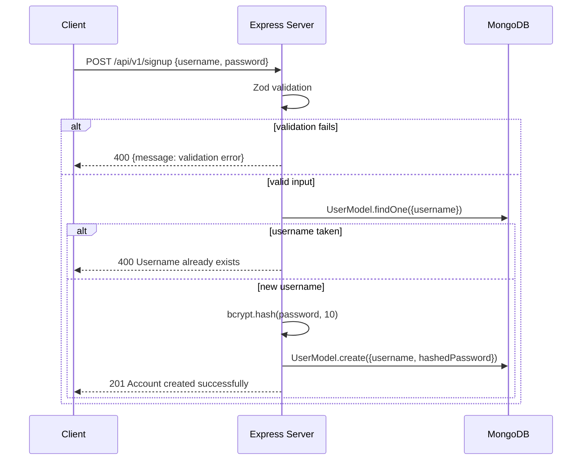
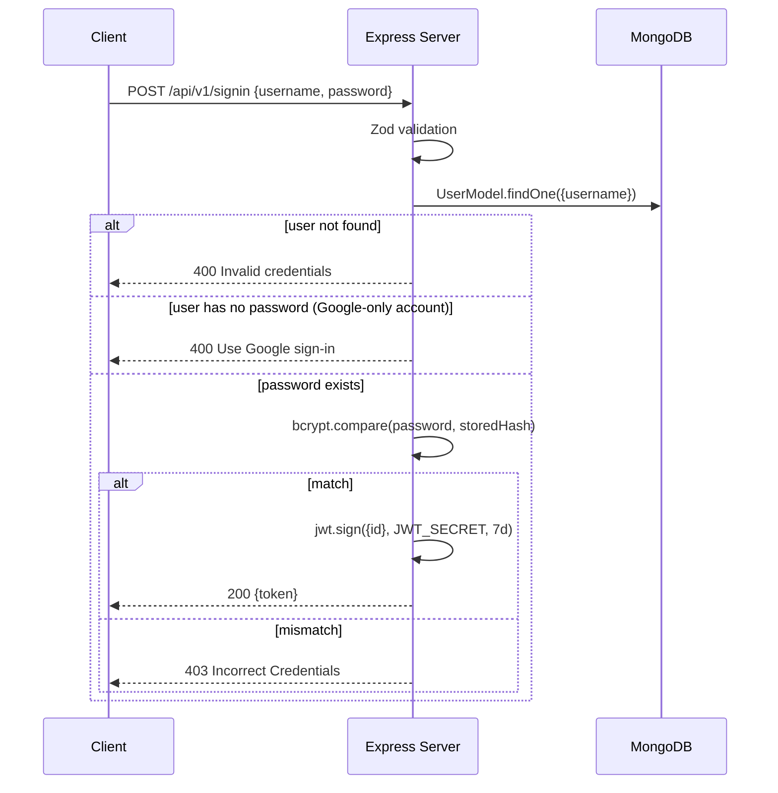
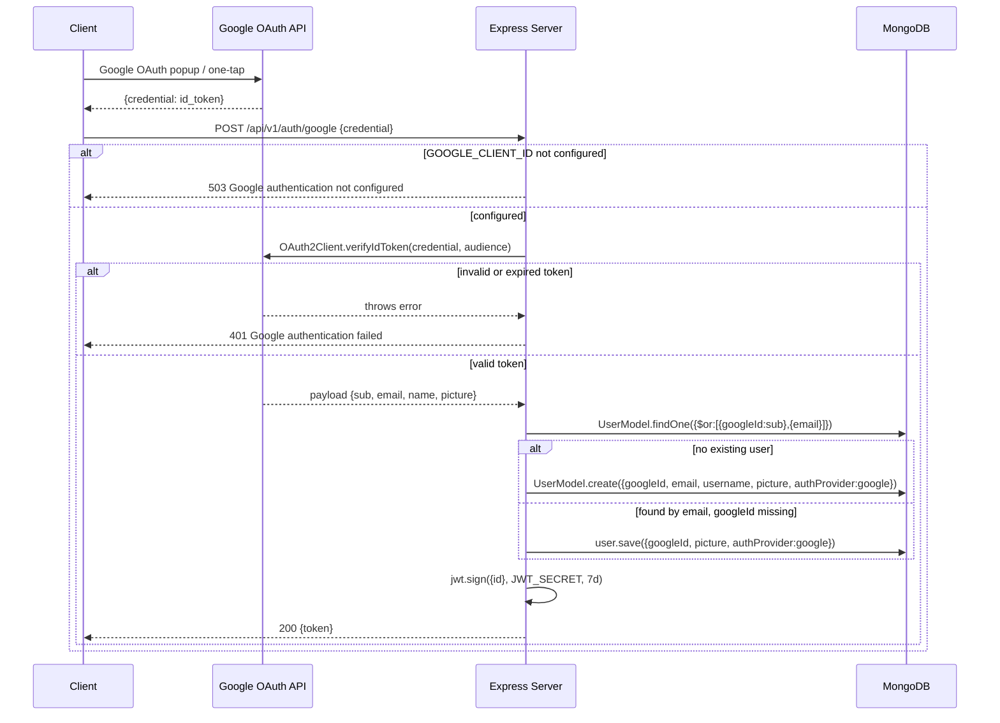

## POST /api/v1/signup

Register a new user account with username/password.

**Rate limit:** 10/15min per IP · **Auth:** None

**Request body:**

```json
{
  "username": "john_doe",
  "password": "mypassword"
}
```

**Validation:** username 3–30 chars (letters/numbers/underscores); password 6–100 chars.

| Status | Body | Condition |
| --- | --- | --- |
| `201` | `{ message: "Account created successfully" }` | Success |
| `400` | `{ message: "Username already exists" }` | Duplicate username |
| `400` | `{ message: "<validation error>" }` | Invalid input |
| `500` | `{ message: "Failed to create account" }` | DB error |



## POST /api/v1/signin

Authenticate with username/password. Returns a JWT.

**Rate limit:** 10/15min per IP · **Auth:** None

**Request body:**

```json
{
  "username": "john_doe",
  "password": "mypassword"
}
```

| Status | Body | Condition |
| --- | --- | --- |
| `200` | `{ token: "<jwt>" }` | Success — JWT expires in 7 days |
| `400` | `{ message: "Invalid credentials" }` | User not found |
| `400` | `{ message: "This account uses Google sign-in..." }` | Google-only account |
| `403` | `{ message: "Incorrect Credentials" }` | Wrong password |



## POST /api/v1/auth/google

Google OAuth sign-in / sign-up. Verifies a Google ID token and returns a JWT.

**Rate limit:** 10/15min per IP · **Auth:** None

**Request body:**

```json
{
  "credential": "<google_id_token>"
}
```

**Behavior:**

- Verifies the `credential` token with `GOOGLE_CLIENT_ID`.
- Looks up an existing user by `googleId` OR `email`.
- If no user found: creates a new user (username = email prefix).
- If found by email but no `googleId`: links the Google account to the existing one.
- Issues a JWT (7-day expiry).

| Status | Body | Condition |
| --- | --- | --- |
| `200` | `{ token: "<jwt>" }` | Success |
| `400` | `{ message: "Google credential is required" }` | Missing credential |
| `401` | `{ message: "Google authentication failed", detail: "..." }` | Invalid token |
| `503` | `{ message: "Google authentication is not configured" }` | `GOOGLE_CLIENT_ID` not set |


