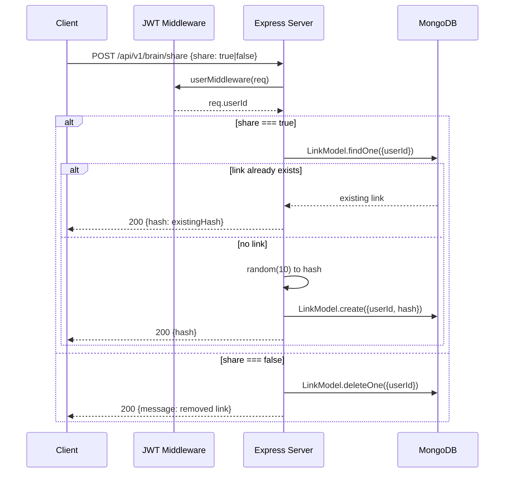
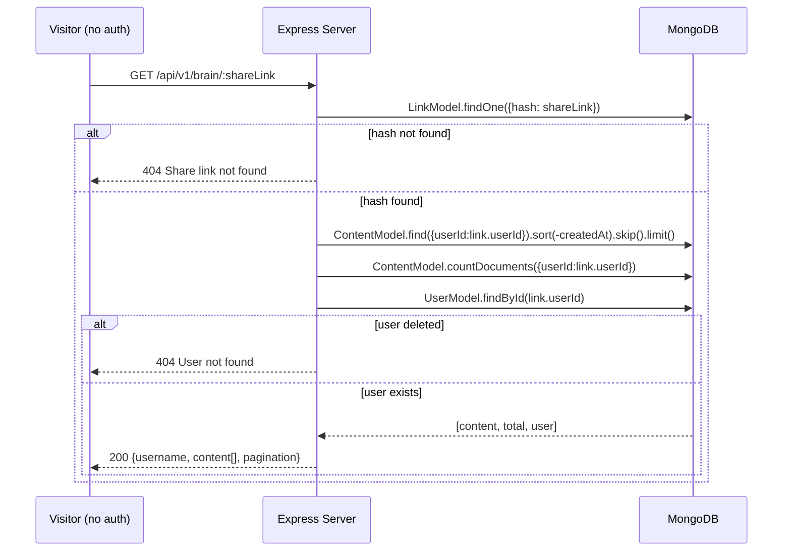

## POST /api/v1/brain/share

Create or revoke a public share link for the user's entire brain.

**Auth:** Required (JWT)

**Request body:**

```json
{ "share": true }   // enable sharing
{ "share": false }  // revoke sharing
```

**Behavior (`share: true`):** if a link already exists for this user, returns the
existing hash (idempotent); otherwise creates one with a new 10-char random hash.

**Behavior (`share: false`):** deletes the `Link` document for this user.

| Status | Body | Condition |
| --- | --- | --- |
| `200` | `{ hash: "abc1234xyz" }` | Sharing enabled (new or existing) |
| `200` | `{ message: "removed link" }` | Sharing revoked |



## GET /api/v1/brain/:shareLink

Fetch a user's brain by share hash. **Public — no auth.**

**URL param:** `shareLink` — the 10-char hash. **Query params:** `limit`
(default 1000, max 1000), `skip` (default 0).

**Response `200`:**

```json
{
  "username": "john_doe",
  "content": [ {} ],
  "pagination": { "total": 42, "limit": 1000, "skip": 0, "hasMore": false }
}
```

| Status | Body | Condition |
| --- | --- | --- |
| `200` | `{ username, content[], pagination }` | Found |
| `404` | `{ message: "Share link not found" }` | Hash doesn't exist |
| `404` | `{ message: "User not found" }` | User was deleted |
| `500` | `{ message: "Failed to load shared brain" }` | DB error |


