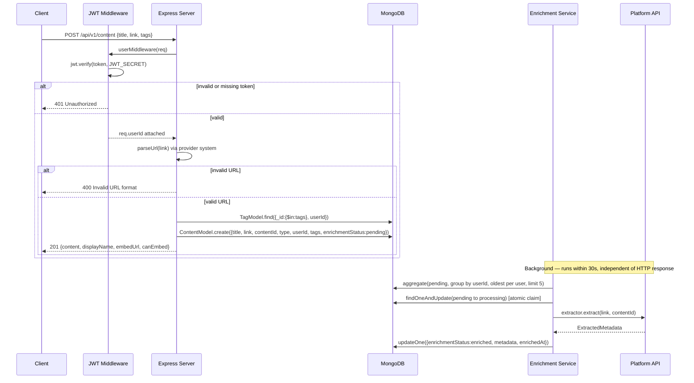
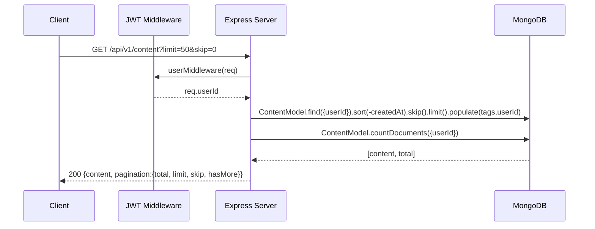
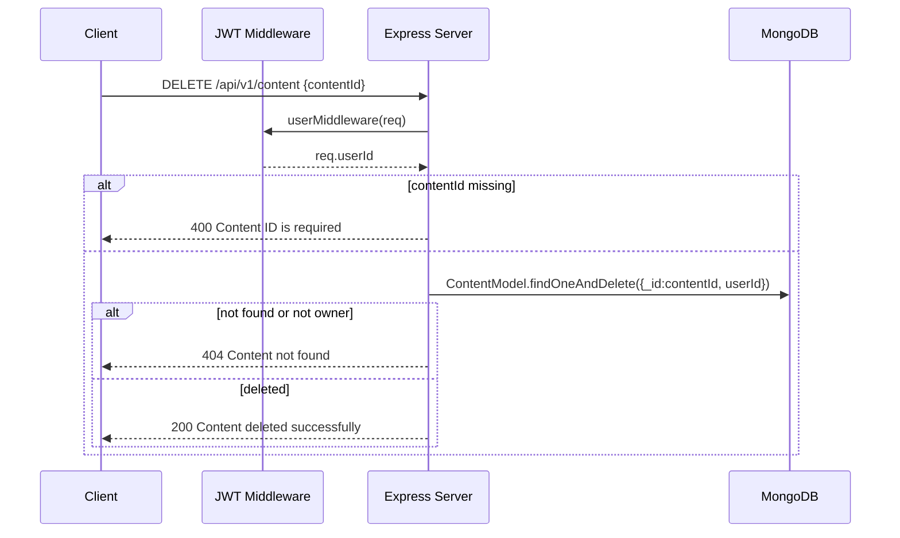
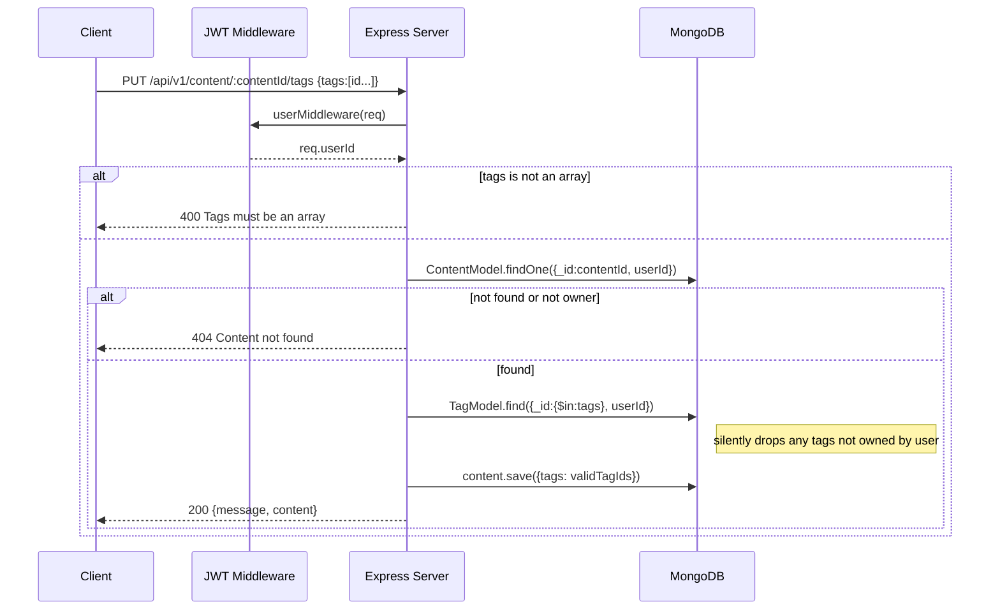

## POST /api/v1/content

Save a new URL to the user's brain.

**Rate limit:** 30/15min per IP · **Auth:** Required (JWT)

**Request body:**

```json
{
  "title": "My Video Title",
  "link": "https://www.youtube.com/watch?v=dQw4w9WgXcQ",
  "tags": ["tagId1", "tagId2"]
}
```

**Behavior:**

- Parses `link` with the provider system to extract `type` and `contentId`.
- Validates that `tags` IDs belong to the authenticated user (silently drops invalid ones).
- Creates a `Content` document with `enrichmentStatus: 'pending'`.
- The enrichment service picks it up within 30s and fetches metadata in the background.

| Status | Body | Condition |
| --- | --- | --- |
| `201` | `{ message, content: { ...doc, displayName, embedUrl, canonicalUrl, canEmbed } }` | Success |
| `400` | `{ message: "Title is required" }` | Missing/empty title |
| `400` | `{ message: "Title must be 500 characters or less" }` | Title too long |
| `400` | `{ message: "Invalid URL format..." }` | URL fails provider parse |
| `500` | `{ message: "Failed to create content" }` | DB error |



## GET /api/v1/content

Fetch all content for the authenticated user.

**Auth:** Required (JWT)

**Query params:**

| Param | Default | Max | Description |
| --- | --- | --- | --- |
| `limit` | 1000 | 1000 | Number of items to return |
| `skip` | 0 | — | Offset for pagination |

**Response `200`:**

```json
{
  "content": [
    {
      "_id": "...",
      "title": "...",
      "link": "...",
      "type": "youtube",
      "contentId": "dQw4w9WgXcQ",
      "tags": [{ "_id": "...", "name": "..." }],
      "userId": { "_id": "...", "username": "..." },
      "enrichmentStatus": "enriched",
      "metadata": { },
      "createdAt": "..."
    }
  ],
  "pagination": { "total": 42, "limit": 1000, "skip": 0, "hasMore": false }
}
```

`tags` and `userId` are populated (not raw ObjectIds).



## DELETE /api/v1/content

Delete a content item. Only the owner can delete.

**Auth:** Required (JWT)

**Request body:** `{ "contentId": "<mongodb_object_id>" }`

| Status | Body | Condition |
| --- | --- | --- |
| `200` | `{ message: "Content deleted successfully" }` | Deleted |
| `400` | `{ message: "Content ID is required" }` | Missing body field |
| `400` | `{ message: "Invalid contentId format" }` | Bad ObjectId format |
| `404` | `{ message: "Content not found" }` | Not found or not owned by user |



## POST /api/v1/content/validate

Validate a URL without saving it. Returns preview information for the UI.

**Auth:** Required (JWT)

**Request body:** `{ "link": "https://github.com/torvalds/linux" }`

**Response `200`:**

```json
{
  "valid": true,
  "type": "github",
  "displayName": "GitHub",
  "contentId": "torvalds/linux",
  "embedUrl": null,
  "canonicalUrl": "https://github.com/torvalds/linux",
  "canEmbed": false,
  "embedType": "card"
}
```

**Response `400`:** `{ "valid": false, "message": "Invalid URL format..." }`

This endpoint is pure in-process — it calls `parseUrl(link)` with no DB or network
access.

## GET /api/v1/content/providers

List all active content providers. **Public — no auth.**

**Response `200`:**

```json
{
  "providers": [
    { "type": "youtube", "displayName": "YouTube", "supportsEmbed": true }
  ]
}
```

Returns the in-memory provider registry via `getProviderInfo()`, which exposes
only `type`, `displayName`, and `supportsEmbed` per provider.

## PUT /api/v1/content/:contentId/tags

Replace the tags on an existing content item.

**Auth:** Required (JWT) · **URL param:** `contentId`

**Request body:** `{ "tags": ["tagId1", "tagId2"] }`

**Behavior:** verifies content ownership, replaces the entire tags array (not
additive), and silently drops any tag IDs not owned by the user.

| Status | Body | Condition |
| --- | --- | --- |
| `200` | `{ message: "Tags updated successfully", content: {...} }` | Updated |
| `400` | `{ message: "Tags must be an array" }` | Invalid body |
| `404` | `{ message: "Content not found" }` | Not found or not owned |
| `500` | `{ message: "Failed to update tags" }` | DB error |


