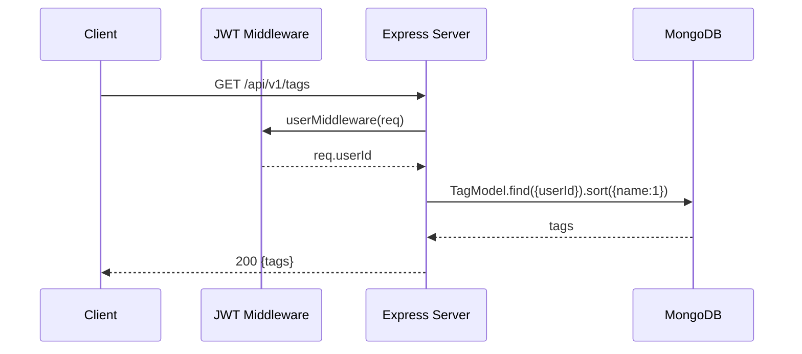
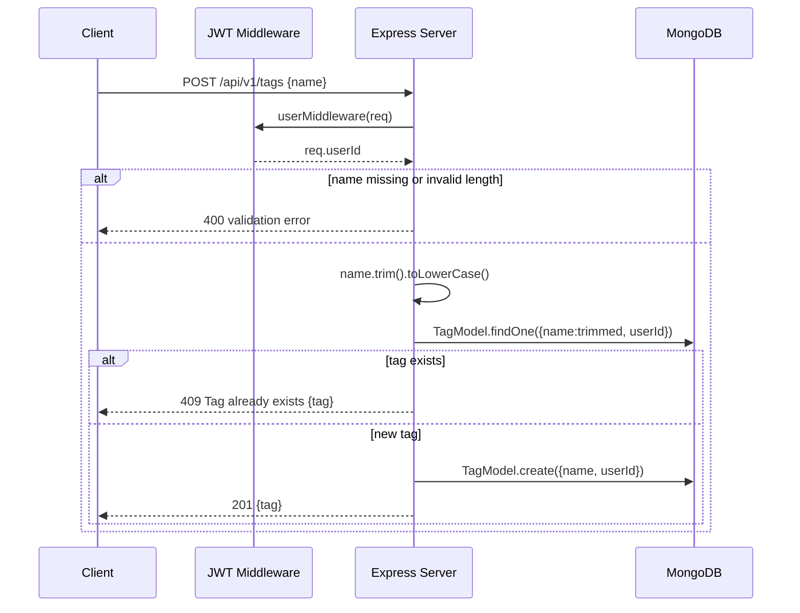
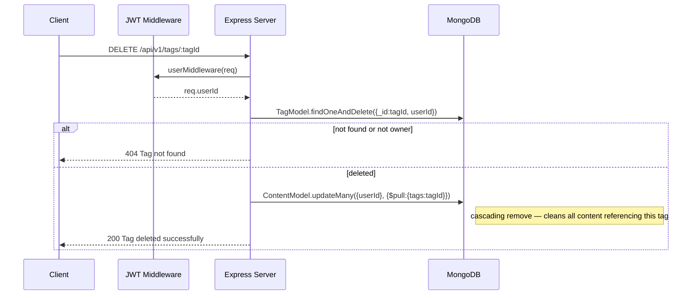

## GET /api/v1/tags

Get all tags belonging to the authenticated user, sorted alphabetically by name.

**Auth:** Required (JWT)

**Response `200`:**

```json
{
  "tags": [
    { "_id": "...", "name": "machine-learning", "userId": "...", "createdAt": "..." }
  ]
}
```



## POST /api/v1/tags

Create a new tag for the authenticated user.

**Auth:** Required (JWT)

**Request body:** `{ "name": "machine-learning" }`

**Behavior:** name is trimmed and lowercased; duplicate check per user returns
`409` if it already exists.

| Status | Body | Condition |
| --- | --- | --- |
| `201` | `{ message: "Tag created successfully", tag: {...} }` | Created |
| `400` | `{ message: "Tag name is required" }` | Missing name |
| `400` | `{ message: "Tag name must be 1-50 characters" }` | Length invalid |
| `409` | `{ message: "Tag already exists", tag: {...} }` | Duplicate |
| `500` | `{ message: "Failed to create tag" }` | DB error |



## DELETE /api/v1/tags/:tagId

Delete a tag and remove it from all content that referenced it.

**Auth:** Required (JWT) · **URL param:** `tagId`

**Behavior:** deletes the tag document, then runs
`ContentModel.updateMany({ userId }, { $pull: { tags: tagId } })` to clean
references (cascading remove).

| Status | Body | Condition |
| --- | --- | --- |
| `200` | `{ message: "Tag deleted successfully" }` | Deleted |
| `404` | `{ message: "Tag not found" }` | Not found or not owned |
| `500` | `{ message: "Failed to delete tag" }` | DB error |


