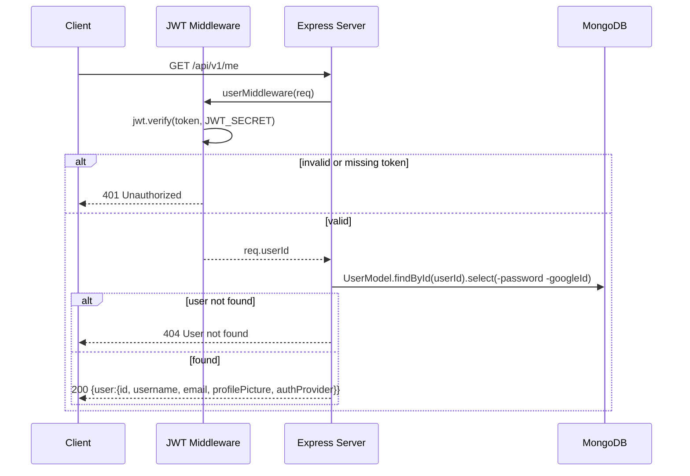

## GET /api/v1/me

Get the authenticated user's profile. `password` and `googleId` are excluded from
the response.

**Auth:** Required (JWT)

**Response `200`:**

```json
{
  "user": {
    "id": "...",
    "username": "john_doe",
    "email": "john@example.com",
    "profilePicture": "https://...",
    "authProvider": "google"
  }
}
```

| Status | Body | Condition |
| --- | --- | --- |
| `200` | `{ user: {...} }` | Found |
| `404` | `{ message: "User not found" }` | User missing |
| `401` | `{ message: "..." }` | Invalid or missing token |


