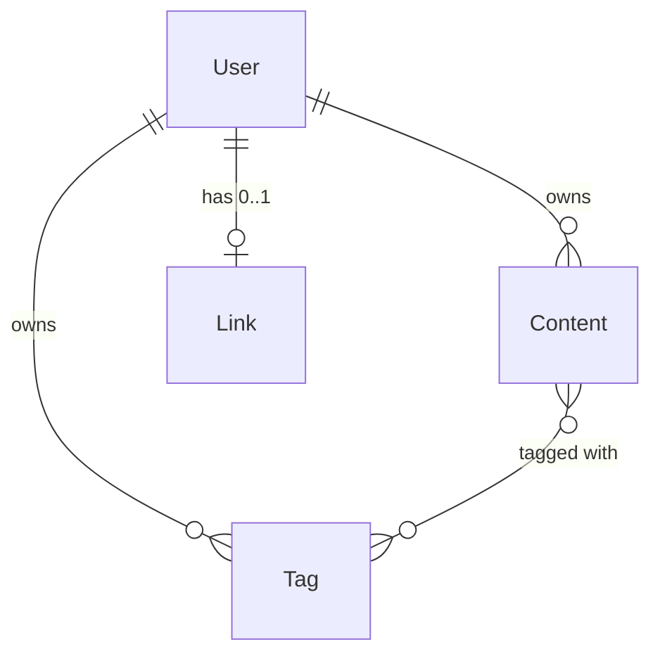

All schemas are defined in `backend/src/db.ts`. These models surface through the
[API](/docs/api-reference/content) and drive the
[Enrichment Pipeline](/docs/architecture/enrichment-pipeline).

## Relationships



```text
User (1) ──── (many) Content
User (1) ──── (many) Tag
User (1) ──── (0..1) Link
Content (many) ──── (many) Tag
```

## UserModel

| Field | Type | Notes |
| --- | --- | --- |
| `username` | String | Unique, sparse (null-safe for Google users) |
| `email` | String | Unique, sparse |
| `password` | String | Bcrypt hash; absent for Google-only accounts |
| `googleId` | String | Unique, sparse; Google `sub` claim |
| `profilePicture` | String | URL from Google profile |
| `authProvider` | String | `'local'` or `'google'` |
| `createdAt` | Date | Auto-set |

## TagModel

| Field | Type | Notes |
| --- | --- | --- |
| `name` | String | Required; stored lowercase |
| `userId` | ObjectId | Ref: User |
| `createdAt` | Date | Auto-set |

Compound unique index on `{ name, userId }` — tags are scoped per user.

## ContentModel

| Field | Type | Notes |
| --- | --- | --- |
| `title` | String | User-provided, max 500 chars |
| `link` | String | Original URL as submitted |
| `contentId` | String | Platform ID (video ID, tweet ID, URL hash) |
| `type` | String | Provider type: `youtube`, `twitter`, `github`, `medium`, `instagram`, `link` |
| `tags` | ObjectId[] | Ref: Tag |
| `userId` | ObjectId | Ref: User |
| `enrichmentStatus` | String | `pending` → `processing` → `enriched` / `failed` / `skipped` |
| `enrichmentError` | String | Last error message |
| `enrichmentRetries` | Number | Retry attempt count |
| `enrichedAt` | Date | When enrichment succeeded |
| `metadata.title` | String | Enriched title from platform API |
| `metadata.description` | String | |
| `metadata.author` | String | |
| `metadata.authorUrl` | String | |
| `metadata.thumbnailUrl` | String | |
| `metadata.publishedDate` | Date | |
| `metadata.tags` | String[] | Platform-provided tags |
| `metadata.language` | String | Detected/declared content language |
| `metadata.fullText` | String | Full text for search/RAG |
| `metadata.fullTextType` | String | `transcript`, `article`, `markdown`, `plain` |
| `metadata.transcriptSegments` | Array | `{ text, start, duration }` — YouTube only |
| `metadata.providerData` | Mixed | Platform-specific structured data |
| `metadata.extractedAt` | Date | When the extractor ran |
| `metadata.extractorVersion` | String | Extractor version that produced the metadata |
| `createdAt` / `updatedAt` | Date | Auto via `timestamps: true` |

Indexes:

```ts
ContentSchema.index({ userId: 1, createdAt: -1 });          // User content listing
ContentSchema.index({ enrichmentStatus: 1, createdAt: 1 }); // Enrichment polling
```

## LinkModel

| Field | Type | Notes |
| --- | --- | --- |
| `hash` | String | 10-char alphanumeric share token |
| `userId` | ObjectId | Unique — one share link per user |

## connectDB()

Reads `MONGO_URI` from env, calls `mongoose.connect()`. Throws on a missing URI
or a connection failure.
