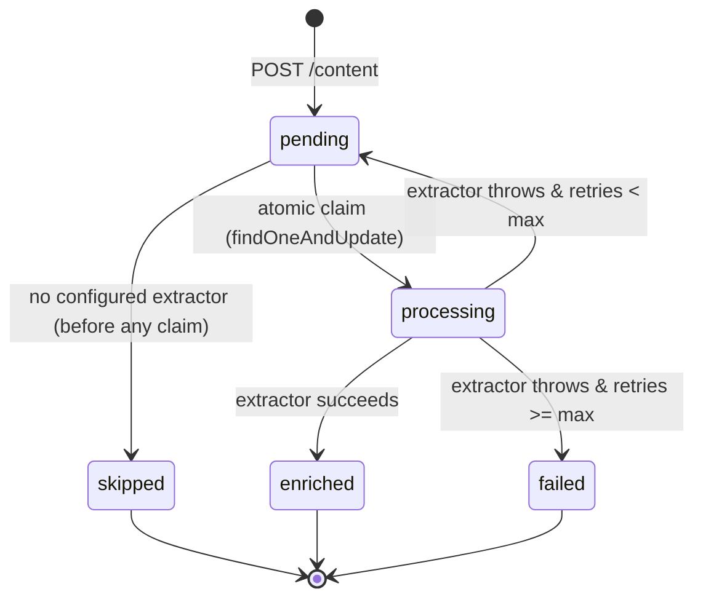

When a user saves a link, the **Provider** layer classifies it synchronously and
the content is stored with `enrichmentStatus: 'pending'`. A background poller
then drives each item through the enrichment lifecycle. The detailed
implementation lives in the [Enrichment Service](/docs/backend/enrichment-service)
backend reference; this page covers the conceptual model.

## State machine



| State | Meaning |
| --- | --- |
| `pending` | Newly created, or previously failed and eligible for retry |
| `processing` | Atomically claimed by a worker; prevents double processing |
| `enriched` | Metadata successfully extracted and stored in `metadata` |
| `failed` | All retries exhausted; `enrichmentError` has the last error |
| `skipped` | No configured extractor for this content type |

`skipped` is reached from `pending` when `isExtractorConfigured(type)` returns
false — before any atomic claim or API call. `failed` is reached from
`processing` after exhausting all retries.

## Fair batching

The poller selects work via a MongoDB aggregation pipeline that groups by
`userId` and picks the oldest pending item per user, limited to `BATCH_SIZE = 5`
total. This prevents one user with hundreds of saved items from starving every
other user.

```text
[
    { $match: { enrichmentStatus: 'pending', /* retry eligibility */ } },
    { $sort:  { createdAt: 1 } },           // Oldest first
    { $group: { _id: '$userId',             // One item per user
                docId: { $first: '$_id' } } },
    { $sort:  { createdAt: 1 } },           // Oldest-user-item first across users
    { $limit: BATCH_SIZE },
]
```

## Crash recovery

On server startup, `startEnrichmentService()` resets all documents stuck in
`processing` back to `pending` via `updateMany`. This handles the case where the
server crashed mid-extraction, so no item is permanently stranded.

## Bounded resource usage

- Max **3** concurrent extractor calls (`CONCURRENCY`).
- Max **5** items per poll cycle (`BATCH_SIZE`).
- **5 MB** response body limit and **15s** request timeout per fetch.
- Poll interval: **30 seconds**; retries capped at **3** with a **60s** minimum delay.
