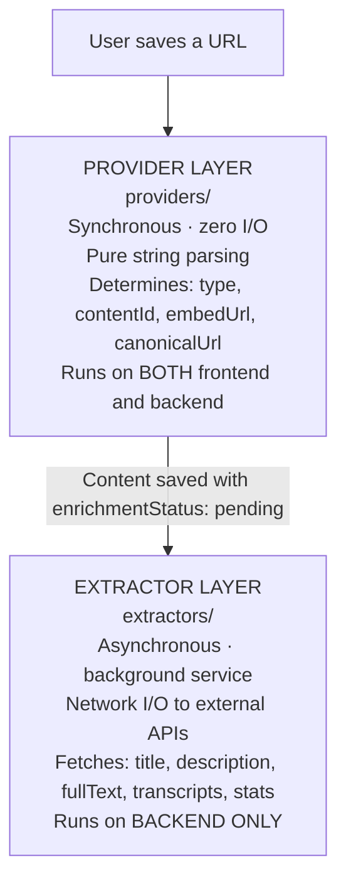

Brainly's backend has one architectural idea worth understanding before anything
else: the **separation between Providers and Extractors**.

## Providers vs Extractors

This is the most important architectural distinction in the system. The two
layers are completely separate and serve different purposes.



| Dimension | Providers | Extractors |
| --- | --- | --- |
| **Purpose** | Parse and classify a URL | Fetch rich metadata from APIs |
| **When it runs** | Synchronously during POST | Asynchronously in background poller |
| **What it produces** | `ParsedContent` (type, embedUrl) | `ExtractedMetadata` (fullText, stats) |
| **I/O cost** | Zero (pure string parsing) | Network calls to external APIs |
| **Failure impact** | Request returns 400 | Sets enrichmentStatus to `failed` |
| **Requires API key** | Never | Some (YouTube, optionally GitHub) |
| **Runs where** | Frontend + Backend | Backend only |
| **Interface** | `ContentProvider` | `ContentExtractor` |

**Why separate?** The provider tells the system _what_ the content is and _how
to embed_ it. The extractor tells the system _everything about_ the content for
AI/search. Providers must be fast and synchronous (they block the save request).
Extractors can take seconds and must never block the user.

Dive deeper: [Provider System](/docs/backend/providers) ·
[Extractor System](/docs/backend/extractors) ·
[Enrichment Pipeline](/docs/architecture/enrichment-pipeline) ·
[Data Models](/docs/architecture/data-models). New to the vocabulary? See the
[Glossary](/docs/glossary).

## Server boot sequence

```text
main() in index.ts
    │
    ├─ 1. connectDB()
    │      └── mongoose.connect(MONGO_URI)
    │
    ├─ 2. app.listen(PORT)
    │      └── logger.info({ port }, 'Server running')
    │
    └─ 3. startEnrichmentService()
           ├── Check config.extractors.enabled (skip if false)
           ├── Reset stale 'processing' → 'pending' (crash recovery)
           ├── Log poll interval
           ├── processNextBatch() — immediate first run
           └── setInterval(processNextBatch, pollIntervalMs)

main().catch((err) => {
    logger.fatal({ err }, 'Fatal startup error');
    process.exit(1);
});
```

**Why async `main()`?**

- `connectDB()` must complete before the server accepts requests.
- `startEnrichmentService()` must complete crash recovery before polling starts.
- Fatal errors during boot surface immediately with proper logging and a non-zero
  exit code.

## Design goals

- **Zero cost** — all APIs used are free-tier.
- **Zero user dependency** — API keys are server-side; users never provide keys.
- **Modular** — each provider/extractor is a self-contained plugin.
- **Resilient** — retries, crash recovery, atomic claims, bounded concurrency.
- **RAG-ready** — full-text extraction (transcripts, articles, READMEs) is stored
  for future vector embedding.
