# Brainly Monorepo — Complete Codebase Reference

> Last updated: 2026-06-08  
> A "second brain" personal knowledge management app. Save any URL (YouTube, Twitter, GitHub, articles, etc.), auto-enrich it with metadata, tag it, and optionally share your whole brain publicly.

---

## Table of Contents

1. [Project Overview](#1-project-overview)
2. [Repository Structure](#2-repository-structure)
3. [Backend](#3-backend)
   - [Entry Point & Server](#31-entry-point--server-srcindexts)
   - [Database Layer](#32-database-layer-srcdbts)
   - [Middleware](#33-middleware-srcmiddlewarets)
   - [Configuration](#34-configuration-srcconfigts)
   - [Logger](#35-logger-srcloggerts)
   - [Utils](#36-utils-srcutilsts)
   - [Types](#37-types-srctypesdts)
   - [Provider System](#38-provider-system-srcproviders)
   - [Extractor System](#39-extractor-system-srcextractors)
   - [Enrichment Service](#310-enrichment-service-srcservicesenrichmentservicets)
   - [Tests](#311-backend-tests-srctests)
4. [Backend API Routes — Full Reference](#4-backend-api-routes--full-reference)
5. [Frontend](#5-frontend)
   - [Entry Point & Router](#51-entry-point--router)
   - [Pages](#52-pages)
   - [Components](#53-components)
   - [Hooks](#54-hooks)
   - [Lib Utilities](#55-lib-utilities)
   - [Providers (Frontend Mirror)](#56-providers-frontend-mirror)
   - [Icons](#57-icons)
   - [MagicUI Components](#58-magicui-components)
   - [Types & Config](#59-types--config)
   - [Tests](#510-frontend-tests)
6. [Frontend Routes](#6-frontend-routes)
7. [Data Models](#7-data-models)
8. [Environment Variables](#8-environment-variables)
9. [CI/CD](#9-cicd)
10. [Key Flows End-to-End](#10-key-flows-end-to-end)

---

## 1. Project Overview

Brainly is a monorepo with:
- **`backend/`** — Node.js + Express + TypeScript API server, MongoDB via Mongoose
- **`frontend/`** — React 19 + Vite + TypeScript SPA, Tailwind CSS v4

Core capabilities:
- Save any URL by pasting it — the system auto-detects the platform (YouTube, Twitter/X, GitHub, Medium, Instagram, Notion, or generic)
- Background enrichment service fetches metadata (title, description, thumbnails, transcripts, README content) from platform APIs
- Organize content with user-scoped tags
- Share your entire "brain" publicly via a short link
- Google OAuth + local username/password auth

---

## 2. Repository Structure

```
brainly-monorepo/
├── backend/
│   ├── src/
│   │   ├── index.ts               # Express server, all route definitions
│   │   ├── db.ts                  # Mongoose schemas + DB connection
│   │   ├── middleware.ts           # JWT auth middleware
│   │   ├── config.ts              # Centralized feature flags + API keys
│   │   ├── logger.ts              # Pino logger instance
│   │   ├── utils.ts               # random() hash utility
│   │   ├── types.d.ts             # Express Request type augmentation
│   │   ├── providers/             # URL parsing + platform detection
│   │   ├── extractors/            # Metadata enrichment per platform
│   │   ├── services/
│   │   │   └── enrichment.service.ts  # Background polling enrichment
│   │   └── __tests__/             # Vitest integration tests
│   ├── .env / .env.example
│   └── package.json
├── frontend/
│   ├── src/
│   │   ├── main.tsx               # React root, GoogleOAuthProvider
│   │   ├── App.tsx                # React Router route tree
│   │   ├── config.ts              # BACKEND_URL + GOOGLE_CLIENT_ID from env
│   │   ├── pages/                 # Page-level components
│   │   ├── components/
│   │   │   ├── ui/                # App UI components (Button, Card, Dialog, Sidebar, etc.)
│   │   │   └── magicui/           # Animation/visual effect components
│   │   ├── hooks/                 # Data-fetching custom hooks
│   │   ├── lib/                   # Axios instance, auth token helpers
│   │   ├── providers/             # Frontend mirror of backend provider system
│   │   ├── icons/                 # SVG icon components
│   │   ├── types/                 # Shared TypeScript interfaces
│   │   └── __tests__/             # Vitest unit tests
│   ├── .env / .env.example
│   └── package.json
├── .github/
│   └── workflows/ci.yml           # GitHub Actions CI
├── docs/                          # Engineering docs
├── MIGRATION.md                   # Git history migration notes
└── README.md
```

---

## 3. Backend

### 3.1 Entry Point & Server (`src/index.ts`)

The single file that wires up the entire Express application. 658 lines.

**Responsibilities:**
- Creates the Express `app` instance
- Applies global middleware: Helmet (security headers), CORS, JSON body parser, rate limiters
- Defines all API route handlers inline
- Exports `app` for use by tests
- Guards `main()` behind `process.env.VITEST` so tests don't auto-start the server
- `main()` connects to MongoDB, starts the HTTP server, and starts the enrichment service

**Security middleware applied at startup:**
- `helmet()` — sets HTTP security headers (CSP disabled since frontend is a separate SPA; COEP disabled to allow YouTube/Twitter iframes)
- `cors()` — restricted to `CORS_ORIGIN` env var (default: `http://localhost:5173`), allows GET/POST/PUT/DELETE/OPTIONS with Authorization header
- Rate limiting (see below)

**Rate limiters:**

| Limiter | Applied to | Limit | Window |
|---------|-----------|-------|--------|
| `globalLimiter` | All routes | 100 req/IP | 15 min |
| `authLimiter` | `/signup`, `/signin`, `/auth/google` | 10 req/IP | 15 min |
| `contentCreationLimiter` | `POST /content` | 30 req/IP | 15 min |

All limiters use `max: 10000` during `VITEST=true` so tests are not throttled.

**Validation schemas (Zod):**
- `signupSchema` — username: 3–30 chars, alphanumeric+underscore; password: 6–100 chars
- `signinSchema` — both fields required, non-empty

---

### 3.2 Database Layer (`src/db.ts`)

Defines all Mongoose schemas and the `connectDB()` function.

#### `UserModel`
| Field | Type | Notes |
|-------|------|-------|
| `username` | String | Unique, sparse (null-safe for Google users) |
| `email` | String | Unique, sparse |
| `password` | String | Bcrypt hash; absent for Google-only accounts |
| `googleId` | String | Unique, sparse; Google sub claim |
| `profilePicture` | String | URL from Google profile |
| `authProvider` | String | `'local'` or `'google'` |
| `createdAt` | Date | Auto-set |

#### `TagModel`
| Field | Type | Notes |
|-------|------|-------|
| `name` | String | Required; stored lowercase |
| `userId` | ObjectId | Ref: User |
| `createdAt` | Date | Auto-set |

Compound unique index on `{ name, userId }` — tags are scoped per user.

#### `ContentModel`
| Field | Type | Notes |
|-------|------|-------|
| `title` | String | User-provided, max 500 chars |
| `link` | String | Original URL as submitted |
| `contentId` | String | Platform ID (video ID, tweet ID, URL hash) |
| `type` | String | Provider type: `youtube`, `twitter`, `github`, `medium`, `instagram`, `link` |
| `tags` | ObjectId[] | Ref: Tag |
| `userId` | ObjectId | Ref: User |
| `enrichmentStatus` | String | `pending` → `processing` → `enriched` / `failed` / `skipped` |
| `enrichmentError` | String | Last error message |
| `enrichmentRetries` | Number | Retry attempt count |
| `enrichedAt` | Date | When enrichment succeeded |
| `metadata.title` | String | Enriched title from platform API |
| `metadata.description` | String | |
| `metadata.author` | String | |
| `metadata.authorUrl` | String | |
| `metadata.thumbnailUrl` | String | |
| `metadata.publishedDate` | Date | |
| `metadata.tags` | String[] | Platform-provided tags |
| `metadata.fullText` | String | Full text for search/RAG |
| `metadata.fullTextType` | String | `transcript`, `article`, `markdown`, `plain` |
| `metadata.transcriptSegments` | Array | `{ text, start, duration }` — YouTube only |
| `metadata.providerData` | Mixed | Platform-specific structured data |
| `createdAt` / `updatedAt` | Date | Auto via `timestamps: true` |

Indexes: `{ userId, createdAt: -1 }` for user queries; `{ enrichmentStatus, createdAt }` for enrichment polling.

#### `LinkModel`
| Field | Type | Notes |
|-------|------|-------|
| `hash` | String | 10-char alphanumeric share token |
| `userId` | ObjectId | Unique — one share link per user |

#### `connectDB()`
Reads `MONGO_URI` from env, calls `mongoose.connect()`. Throws on missing URI or connection failure.

---

### 3.3 Middleware (`src/middleware.ts`)

**`userMiddleware(req, res, next)`**

JWT authentication guard for protected routes.

1. Reads `Authorization: Bearer <token>` header
2. Verifies token with `JWT_SECRET`
3. Attaches `req.userId` (string) from `token.id`
4. Returns `403` if token is missing or invalid

---

### 3.4 Configuration (`src/config.ts`)

Centralized feature flags object. **No env var reads except for API keys.**

```ts
config.providers.youtube      // true  — YouTube URL parser active
config.providers.twitter      // true
config.providers.instagram    // true
config.providers.github       // true
config.providers.medium       // true
config.providers.notion       // false — no extractor yet; URLs would stay stuck in 'pending'

config.extractors.enabled         // true
config.extractors.pollIntervalMs  // 30,000 ms
config.extractors.maxRetries      // 3
config.extractors.retryDelayMs    // 60,000 ms

config.apiKeys.youtubeApiKey      // YOUTUBE_API_KEY env var
config.apiKeys.githubToken        // GITHUB_TOKEN env var
config.apiKeys.twitterBearerToken // TWITTER_BEARER_TOKEN env var
config.apiKeys.instagramAppId     // INSTAGRAM_APP_ID env var
```

---

### 3.5 Logger (`src/logger.ts`)

Exports a Pino logger instance. Log level controlled by `LOG_LEVEL` env var (default: `info`). Used throughout backend with child loggers for service-level context.

---

### 3.6 Utils (`src/utils.ts`)

**`random(len: number): string`**  
Generates a random alphanumeric string of `len` characters. Used to create share link hashes (`random(10)`).

---

### 3.7 Types (`src/types.d.ts`)

Augments the Express `Request` interface to add `userId?: string`. This is what allows `req.userId` in route handlers after `userMiddleware` runs.

---

### 3.8 Provider System (`src/providers/`)

A plugin-based system for parsing URLs and detecting which platform they belong to. The same system is **mirrored in the frontend** for instant client-side validation without a round-trip.

#### `base.ts` — Interfaces

```ts
interface ContentProvider {
  type: string              // 'youtube', 'twitter', etc.
  displayName: string       // 'YouTube', 'Twitter/X', etc.
  hostnames: string[]       // domains this provider handles
  supportsEmbed: boolean
  embedType: EmbedType      // 'iframe' | 'oembed' | 'card' | 'none'
  canHandle(url: URL): boolean
  extractId(url: URL): string | null
  getEmbedUrl?(id: string): string
  getCanonicalUrl(id: string): string
}

type EmbedType = 'iframe' | 'oembed' | 'card' | 'none'
```

#### `index.ts` — Registry

- Registers providers conditionally based on `config.providers.*` flags
- `generic` provider is always registered as fallback
- **`parseUrl(rawUrl)`** — main entry point. Returns `ParsedContent | null`
- **`getProvider(type)`** — look up a provider by type string
- **`getProviderInfo()`** — returns list of all active providers (used by `/api/v1/content/providers`)
- **`isValidUrl(url)`** — basic http/https check

#### Individual Providers

| File | Type | Hostnames | Embed | ID extraction |
|------|------|-----------|-------|---------------|
| `youtube.provider.ts` | `youtube` | youtube.com, youtu.be, m.youtube.com | `iframe` | From `/watch?v=`, `/shorts/`, `/live/`, `/embed/`, youtu.be path |
| `twitter.provider.ts` | `twitter` | twitter.com, x.com, mobile.twitter.com | `oembed` | Numeric tweet ID from `/{user}/status/{id}` |
| `instagram.provider.ts` | `instagram` | instagram.com, m.instagram.com | `oembed` | Base64url shortcode from `/p/`, `/reel/`, `/tv/` |
| `github.provider.ts` | `github` | github.com, gist.github.com | `card` | `owner/repo`, issue/PR numbers, gist IDs; filters non-repo pages |
| `medium.provider.ts` | `medium` | medium.com, *.medium.com | `card` | 10–12 char hex ID from `/p/` or slug tail |
| `notion.provider.ts` | `notion` | notion.so, notion.site | `card` | 32-char hex UUID from page slug |
| `generic.provider.ts` | `link` | any http/https | `card` | MD5 hash of full URL (12 chars) |

---

### 3.9 Extractor System (`src/extractors/`)

Background metadata fetchers, one per content platform. Called by the enrichment service after content is saved.

#### `base.ts` — Interface

```ts
interface ContentExtractor {
  type: string
  displayName: string
  isConfigured(): boolean    // returns false if required API key is missing
  extract(url: string, contentId: string): Promise<ExtractedMetadata>
}
```

#### `registry.ts`

Maps `type` string → extractor instance.  
- **`getExtractor(type)`** — returns the extractor for a type  
- **`isExtractorConfigured(type)`** — returns false if API key is absent, so content gets `skipped` status instead of erroring

#### `safe-fetch.ts`

Fetch wrapper with security and reliability guarantees:
- **SSRF protection** — blocks requests to private IP ranges: `10.x`, `172.16–31.x`, `192.168.x`, `127.x`, `169.254.x`
- **Timeout** — 15 seconds
- **Size limit** — 5 MB response cap
- Exports: `safeFetch()`, `safeFetchText()`, `safeFetchJson()`

#### `html-utils.ts`

**`stripHtml(html)`** — removes HTML tags and decodes HTML entities to plain text.

#### Individual Extractors

**`youtube.extractor.ts`**
- Calls YouTube Data API v3 (`YOUTUBE_API_KEY` required) for snippet, contentDetails, statistics
- Fetches transcript via Innertube player API (no API key needed — undocumented internal API)
- Parses XML caption format into `TranscriptSegment[]` with `{ text, start, duration }`
- Stored: full transcript text, channelId, duration, viewCount, likeCount, category

**`twitter.extractor.ts`**
- Uses Twitter oEmbed endpoint (`https://publish.twitter.com/oembed`) — free, no auth
- Parses tweet author name + URL from the returned HTML
- `fullTextType: 'plain'`

**`github.extractor.ts`**
- GitHub REST API — unauthenticated (60 req/hr) or with `GITHUB_TOKEN` (5000 req/hr)
- For repos: stars, forks, license, default branch, README content (markdown)
- For issues/PRs: title, body, state, comment count, diff stats
- For gists: description, file list with content
- `fullTextType: 'markdown'`

**`instagram.extractor.ts`**
- Scrapes OG meta tags from Instagram post pages (no API needed)
- Extracts hashtags from caption text
- `fullTextType: 'plain'`

**`medium.extractor.ts`**
- Uses `@extractus/article-extractor` to parse article body
- Strips HTML for plain text output
- `fullTextType: 'article'`

**`generic.extractor.ts`**
- Uses `@extractus/article-extractor` as primary
- Falls back to scraping OG meta tags (`og:title`, `og:description`, `og:image`, `author`)
- `fullTextType: 'article'`

---

### 3.10 Enrichment Service (`src/services/enrichment.service.ts`)

A background polling service that enriches saved content with metadata from platform APIs.

**How it works:**

1. On server boot, `startEnrichmentService()` is called after `connectDB()`
2. First resets any content stuck in `processing` state (crash recovery)
3. Runs `processNextBatch()` immediately, then every `pollIntervalMs` (30s)
4. Skips the interval tick if a batch is still processing (`isProcessing` flag)

**Fair batching algorithm:**
- Aggregation pipeline selects only `pending` content within retry window
- Groups by `userId`, picks oldest item per user
- Limits to `BATCH_SIZE = 5` total
- This prevents one user with many bookmarks from starving other users

**Per-item processing:**
1. Check `isExtractorConfigured(type)` — if no extractor, mark `skipped`
2. Atomic claim: `findOneAndUpdate({ _id, enrichmentStatus: 'pending' }, { enrichmentStatus: 'processing' })` — if another instance already claimed it, the update returns null and we skip
3. Run `extractor.extract(link, contentId)`
4. On success: save metadata, set `enrichmentStatus: 'enriched'`
5. On failure: increment `enrichmentRetries`; if `retries >= maxRetries (3)` set `failed`, else back to `pending`

**Concurrency:** `runWithConcurrency(tasks, 3)` — at most 3 extractors run simultaneously per batch.

**Lifecycle:**
- `startEnrichmentService()` — call on boot
- `stopEnrichmentService()` — clears the interval (used in tests)

---

### 3.11 Backend Tests (`src/__tests__/`)

All tests use **Vitest** + **supertest** + **mongodb-memory-server**.

#### `setup.ts`
- Sets `JWT_SECRET`, `CORS_ORIGIN`, `MONGO_URI` env vars at module load time (before any imports)
- Starts in-memory MongoDB via `mongodb-memory-server`
- `afterEach` clears all collections for isolation between tests
- `afterAll` stops the in-memory server

#### `auth.test.ts` — 10 tests
- `POST /api/v1/signup` — success, duplicate username, short password, invalid chars
- `POST /api/v1/signin` — success (returns JWT), wrong password (403), nonexistent user (400)
- `GET /api/v1/content` — without token (403), with invalid token (403), with valid token (200)

#### `content.test.ts` — 11 tests
- Create content with YouTube URL, Twitter URL, generic URL
- Pagination (`limit`, `skip` params)
- Ownership isolation (user A cannot see user B's content)
- Delete content (success, 404 for non-existent, 404 for other user's content)

#### `providers.test.ts` — 18 tests
- `parseUrl()` for YouTube variants (watch, shorts, youtu.be)
- `parseUrl()` for Twitter (twitter.com, x.com)
- Generic fallback for unknown URLs
- `isValidUrl()` — accepts http/https, rejects ftp, empty string

#### `share.test.ts` — 8 tests
- `POST /api/v1/brain/share` with `share: true` — creates hash
- Idempotency — second call returns same hash
- `POST /api/v1/brain/share` with `share: false` — deletes link
- `GET /api/v1/brain/:shareLink` — 200 with content, 404 for bad hash, different user's content is public

---

## 4. Backend API Routes — Full Reference

Base URL: `http://localhost:5000` (configurable via `PORT` env var)

### Authentication

---

#### `POST /api/v1/signup`

Register a new user account with username/password.

**Rate limit:** 10/15min per IP  
**Auth:** None

**Request body:**
```json
{
  "username": "john_doe",
  "password": "mypassword"
}
```

**Validation:**
- `username`: 3–30 chars, only letters/numbers/underscores
- `password`: 6–100 chars

**Responses:**
| Status | Body | Condition |
|--------|------|-----------|
| `201` | `{ message: "Account created successfully" }` | Success |
| `400` | `{ message: "Username already exists" }` | Duplicate username |
| `400` | `{ message: "<validation error>" }` | Invalid input |
| `500` | `{ message: "Failed to create account" }` | DB error |

**Request flow:**
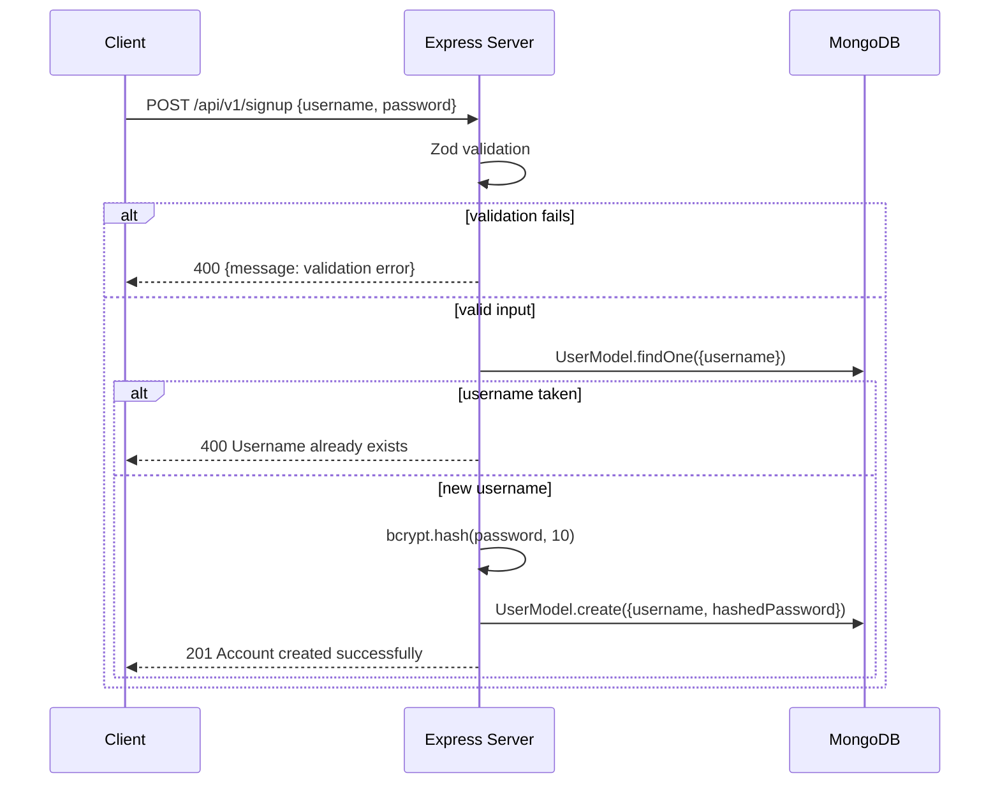

---

#### `POST /api/v1/signin`

Authenticate with username/password. Returns a JWT.

**Rate limit:** 10/15min per IP  
**Auth:** None

**Request body:**
```json
{
  "username": "john_doe",
  "password": "mypassword"
}
```

**Responses:**
| Status | Body | Condition |
|--------|------|-----------|
| `200` | `{ token: "<jwt>" }` | Success — JWT expires in 7 days |
| `400` | `{ message: "Invalid credentials" }` | User not found |
| `400` | `{ message: "This account uses Google sign-in..." }` | Google-only account |
| `403` | `{ message: "Incorrect Credentials" }` | Wrong password |

**Request flow:**
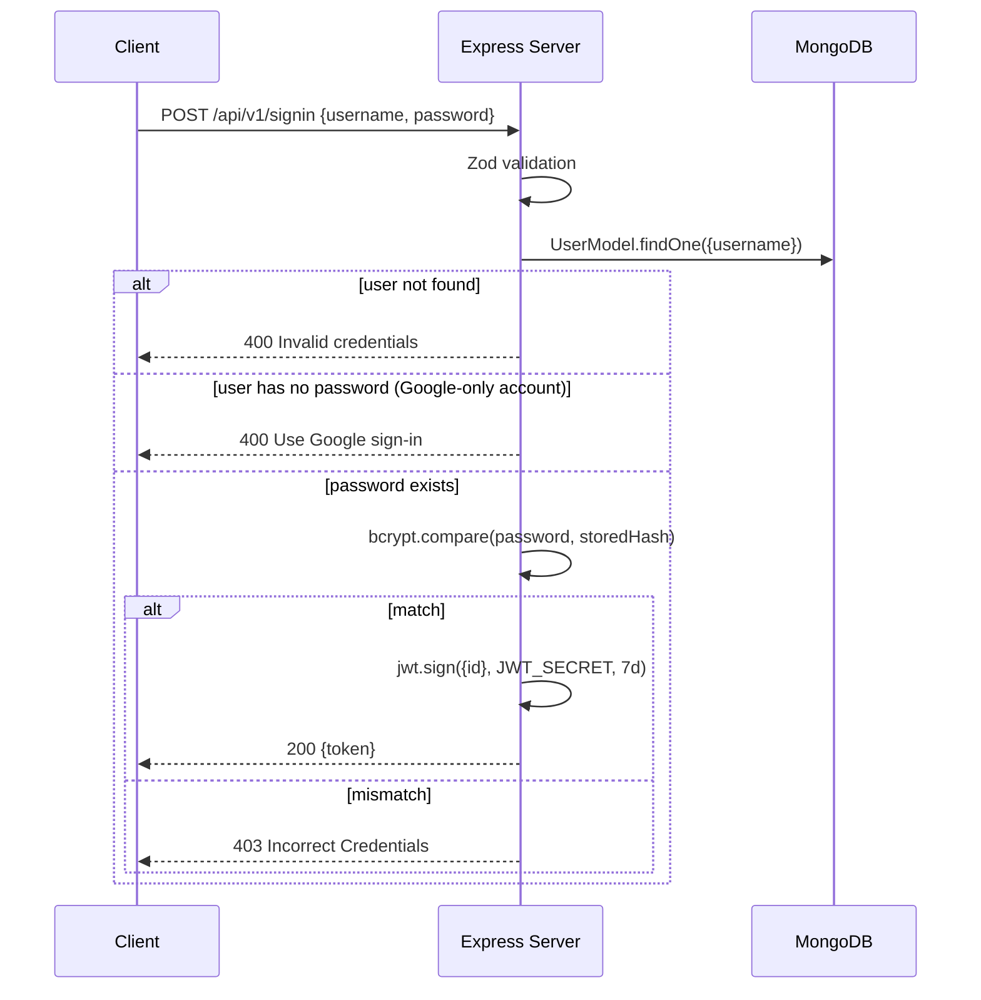

---

#### `POST /api/v1/auth/google`

Google OAuth sign-in / sign-up. Verifies a Google ID token and returns a JWT.

**Rate limit:** 10/15min per IP  
**Auth:** None

**Request body:**
```json
{
  "credential": "<google_id_token>"
}
```

**Behavior:**
- Verifies the `credential` token with `GOOGLE_CLIENT_ID`
- Looks up existing user by `googleId` OR `email`
- If no user found: creates a new user (username = email prefix)
- If user found by email but no `googleId`: links Google account to existing account
- Issues JWT (7-day expiry)

**Responses:**
| Status | Body | Condition |
|--------|------|-----------|
| `200` | `{ token: "<jwt>" }` | Success |
| `400` | `{ message: "Google credential is required" }` | Missing credential |
| `401` | `{ message: "Google authentication failed", detail: "..." }` | Invalid token |
| `503` | `{ message: "Google authentication is not configured" }` | `GOOGLE_CLIENT_ID` not set |

**Request flow:**
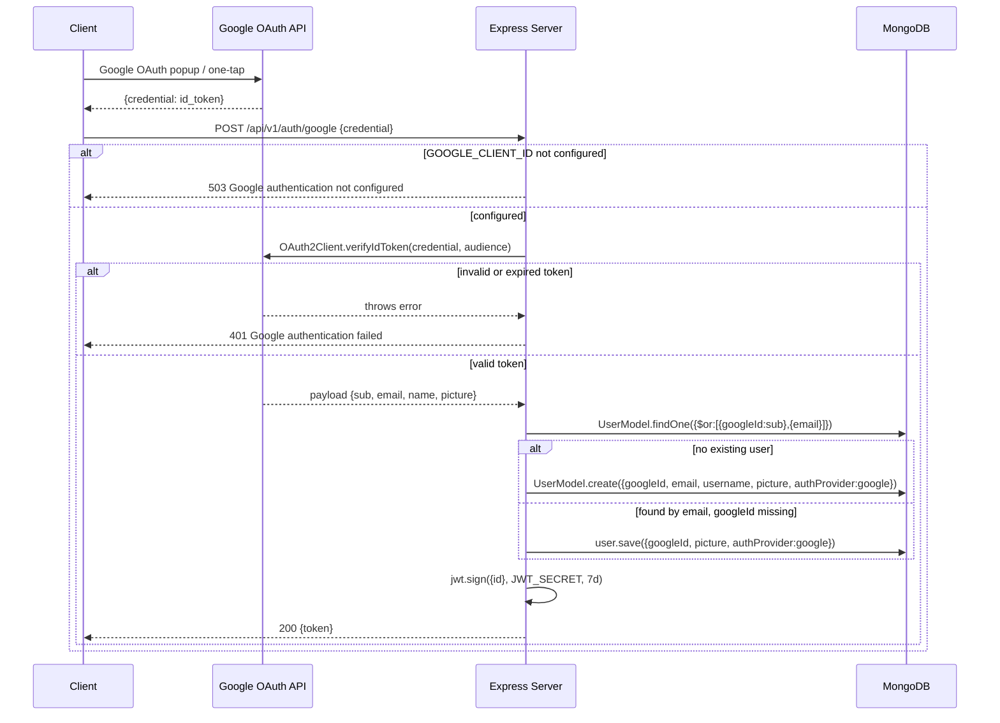

---

### Content

---

#### `POST /api/v1/content`

Save a new URL to the user's brain.

**Rate limit:** 30/15min per IP  
**Auth:** Required (JWT)

**Request body:**
```json
{
  "title": "My Video Title",
  "link": "https://www.youtube.com/watch?v=dQw4w9WgXcQ",
  "tags": ["tagId1", "tagId2"]
}
```

**Behavior:**
- Parses `link` with the provider system to extract `type` and `contentId`
- Validates that `tags` array IDs belong to the authenticated user (silently drops invalid ones)
- Creates a `Content` document with `enrichmentStatus: 'pending'`
- The enrichment service picks it up within 30s and fetches metadata in the background

**Responses:**
| Status | Body | Condition |
|--------|------|-----------|
| `201` | `{ message, content: { ...doc, displayName, embedUrl, canonicalUrl, canEmbed } }` | Success |
| `400` | `{ message: "Title is required" }` | Missing/empty title |
| `400` | `{ message: "Title must be 500 characters or less" }` | Title too long |
| `400` | `{ message: "Invalid URL format..." }` | URL fails provider parse |
| `500` | `{ message: "Failed to create content" }` | DB error |

**Request flow (sync + async enrichment):**
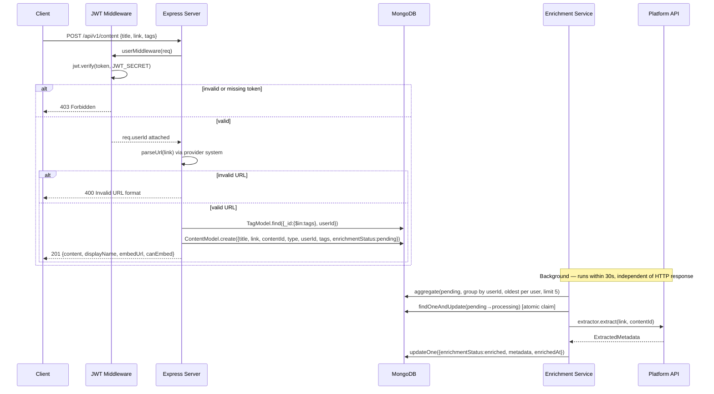

---

#### `GET /api/v1/content`

Fetch all content for the authenticated user.

**Auth:** Required (JWT)

**Query params:**
| Param | Default | Max | Description |
|-------|---------|-----|-------------|
| `limit` | 1000 | 1000 | Number of items to return |
| `skip` | 0 | — | Offset for pagination |

**Response `200`:**
```json
{
  "content": [
    {
      "_id": "...",
      "title": "...",
      "link": "...",
      "type": "youtube",
      "contentId": "dQw4w9WgXcQ",
      "tags": [{ "_id": "...", "name": "..." }],
      "userId": { "_id": "...", "username": "..." },
      "enrichmentStatus": "enriched",
      "metadata": { ... },
      "createdAt": "..."
    }
  ],
  "pagination": { "total": 42, "limit": 1000, "skip": 0, "hasMore": false }
}
```

`tags` and `userId` are populated (not raw ObjectIds).

**Request flow:**
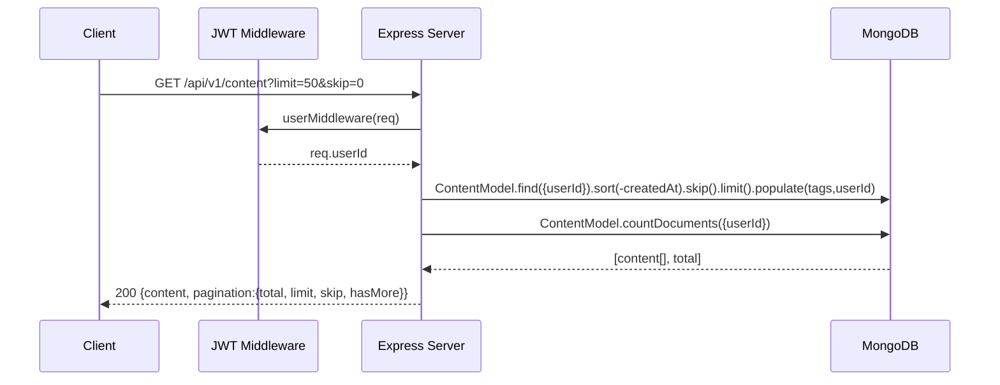

---

#### `DELETE /api/v1/content`

Delete a content item. Only the owner can delete.

**Auth:** Required (JWT)

**Request body:**
```json
{
  "contentId": "<mongodb_object_id>"
}
```

**Responses:**
| Status | Body | Condition |
|--------|------|-----------|
| `200` | `{ message: "Content deleted successfully" }` | Deleted |
| `400` | `{ message: "Content ID is required" }` | Missing body field |
| `400` | `{ message: "Invalid contentId format" }` | Bad ObjectId format |
| `404` | `{ message: "Content not found" }` | Not found or not owned by user |

**Request flow:**
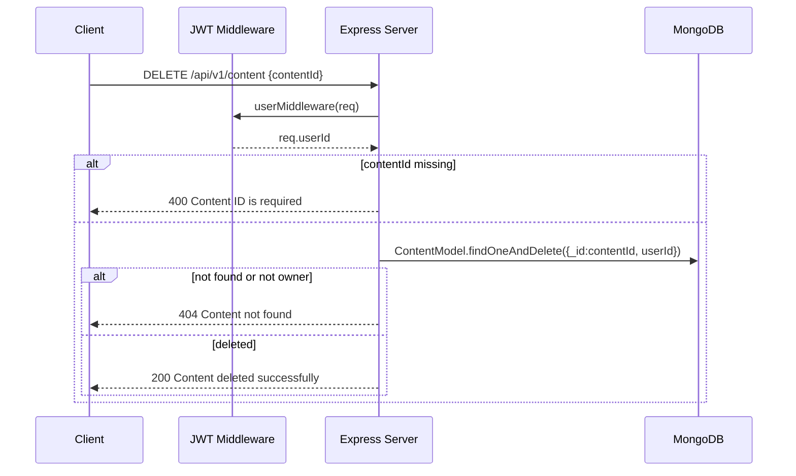

---

#### `POST /api/v1/content/validate`

Validate a URL without saving it. Returns preview information for the UI.

**Auth:** Required (JWT)

**Request body:**
```json
{
  "link": "https://github.com/torvalds/linux"
}
```

**Response `200`:**
```json
{
  "valid": true,
  "type": "github",
  "displayName": "GitHub",
  "contentId": "torvalds/linux",
  "embedUrl": null,
  "canonicalUrl": "https://github.com/torvalds/linux",
  "canEmbed": false,
  "embedType": "card"
}
```

**Response `400`:**
```json
{ "valid": false, "message": "Invalid URL format..." }
```

**Request flow:**
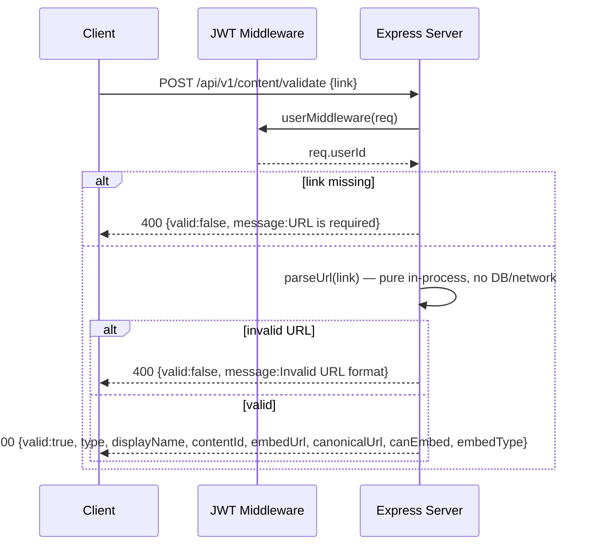

---

#### `GET /api/v1/content/providers`

List all active content providers. Public endpoint — no auth required.

**Response `200`:**
```json
{
  "providers": [
    { "type": "youtube", "displayName": "YouTube", "hostnames": [...], "supportsEmbed": true, "embedType": "iframe" },
    ...
  ]
}
```

**Request flow:**
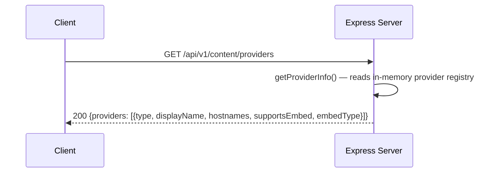

---

#### `PUT /api/v1/content/:contentId/tags`

Replace the tags on an existing content item.

**Auth:** Required (JWT)

**URL param:** `contentId` — MongoDB ObjectId of the content

**Request body:**
```json
{
  "tags": ["tagId1", "tagId2"]
}
```

**Behavior:**
- Verifies content belongs to the authenticated user
- Replaces entire tags array (not additive)
- Silently drops any tag IDs that don't belong to the user

**Responses:**
| Status | Body | Condition |
|--------|------|-----------|
| `200` | `{ message: "Tags updated successfully", content: {...} }` | Updated |
| `400` | `{ message: "Tags must be an array" }` | Invalid body |
| `404` | `{ message: "Content not found" }` | Not found or not owned |
| `500` | `{ message: "Failed to update tags" }` | DB error |

**Request flow:**
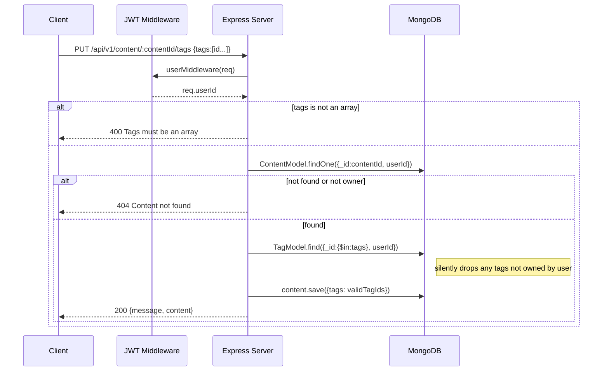

---

### Tags

---

#### `GET /api/v1/tags`

Get all tags belonging to the authenticated user.

**Auth:** Required (JWT)

**Response `200`:**
```json
{
  "tags": [
    { "_id": "...", "name": "machine-learning", "userId": "...", "createdAt": "..." }
  ]
}
```

Tags are returned sorted alphabetically by name.

**Request flow:**
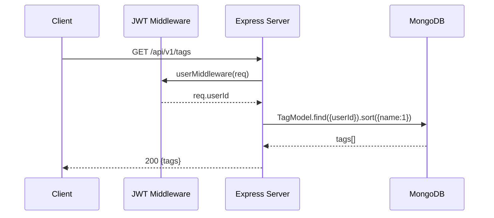

---

#### `POST /api/v1/tags`

Create a new tag for the authenticated user.

**Auth:** Required (JWT)

**Request body:**
```json
{
  "name": "machine-learning"
}
```

**Behavior:**
- Name is trimmed and lowercased
- Duplicate check per user (returns `409` if already exists)

**Responses:**
| Status | Body | Condition |
|--------|------|-----------|
| `201` | `{ message: "Tag created successfully", tag: {...} }` | Created |
| `400` | `{ message: "Tag name is required" }` | Missing name |
| `400` | `{ message: "Tag name must be 1-50 characters" }` | Length invalid |
| `409` | `{ message: "Tag already exists", tag: {...} }` | Duplicate |
| `500` | `{ message: "Failed to create tag" }` | DB error |

**Request flow:**
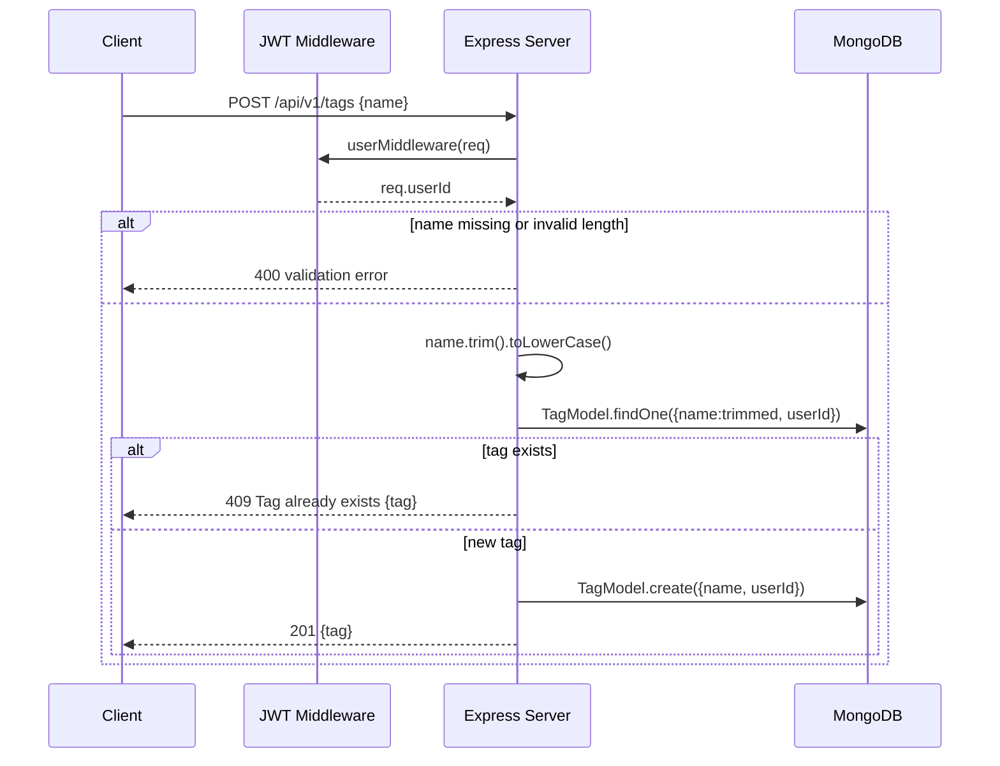

---

#### `DELETE /api/v1/tags/:tagId`

Delete a tag and remove it from all content that referenced it.

**Auth:** Required (JWT)

**URL param:** `tagId` — MongoDB ObjectId of the tag

**Behavior:**
- Deletes the tag document
- Runs `ContentModel.updateMany({ userId }, { $pull: { tags: tagId } })` to clean references

**Responses:**
| Status | Body | Condition |
|--------|------|-----------|
| `200` | `{ message: "Tag deleted successfully" }` | Deleted |
| `404` | `{ message: "Tag not found" }` | Not found or not owned |
| `500` | `{ message: "Failed to delete tag" }` | DB error |

**Request flow:**
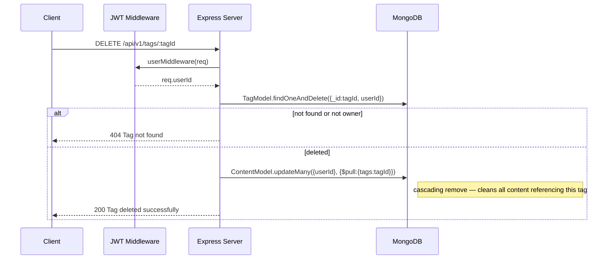

---

### Brain Sharing

---

#### `POST /api/v1/brain/share`

Create or revoke a public share link for the user's entire brain.

**Auth:** Required (JWT)

**Request body:**
```json
{ "share": true }   // enable sharing
{ "share": false }  // revoke sharing
```

**Behavior (share: true):**
- Checks if a link already exists for this user — if so, returns the existing hash (idempotent)
- If no link exists, creates one with a new 10-char random hash

**Behavior (share: false):**
- Deletes the `Link` document for this user

**Responses:**
| Status | Body | Condition |
|--------|------|-----------|
| `200` | `{ hash: "abc1234xyz" }` | Sharing enabled (new or existing) |
| `200` | `{ message: "removed link" }` | Sharing revoked |

**Request flow:**
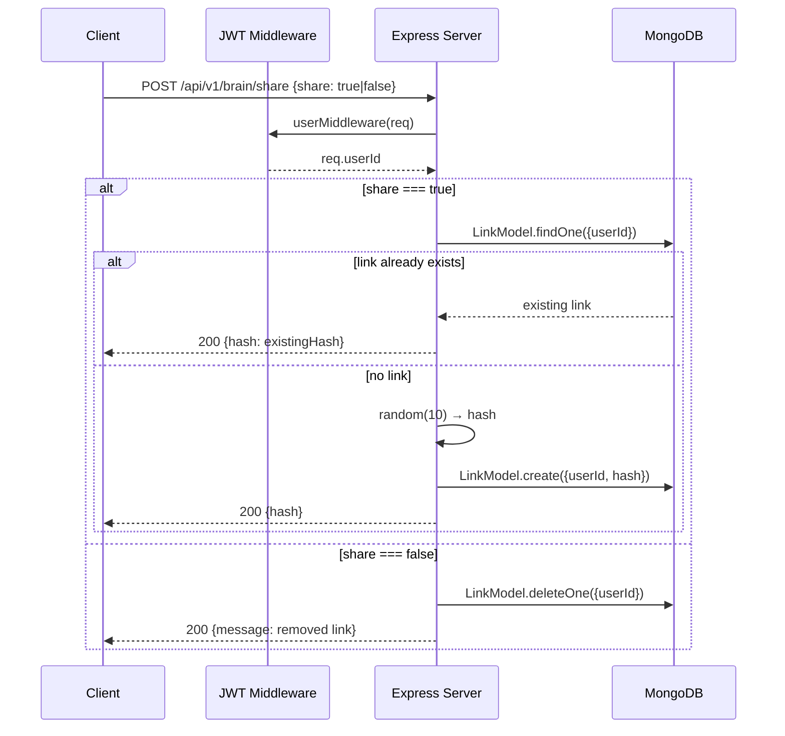

---

#### `GET /api/v1/brain/:shareLink`

Fetch a user's brain by share hash. **Public endpoint — no auth.**

**URL param:** `shareLink` — the 10-char hash from the share link

**Query params:** `limit` (default 1000, max 1000), `skip` (default 0)

**Response `200`:**
```json
{
  "username": "john_doe",
  "content": [ { ... } ],
  "pagination": { "total": 42, "limit": 1000, "skip": 0, "hasMore": false }
}
```

**Responses:**
| Status | Body | Condition |
|--------|------|-----------|
| `200` | `{ username, content[], pagination }` | Found |
| `404` | `{ message: "Share link not found" }` | Hash doesn't exist |
| `404` | `{ message: "User not found" }` | User was deleted |
| `500` | `{ message: "Failed to load shared brain" }` | DB error |

**Request flow:**
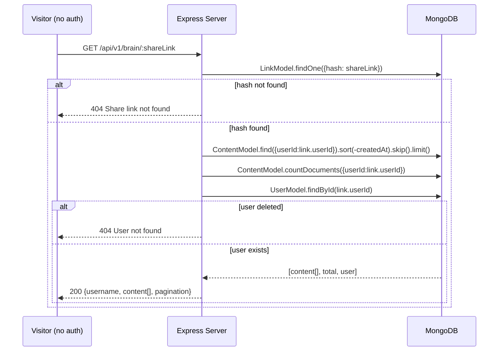

---

### User

---

#### `GET /api/v1/me`

Get the authenticated user's profile.

**Auth:** Required (JWT)

**Response `200`:**
```json
{
  "user": {
    "id": "...",
    "username": "john_doe",
    "email": "john@example.com",
    "profilePicture": "https://...",
    "authProvider": "google"
  }
}
```

`password` and `googleId` fields are excluded from the response.

**Request flow:**
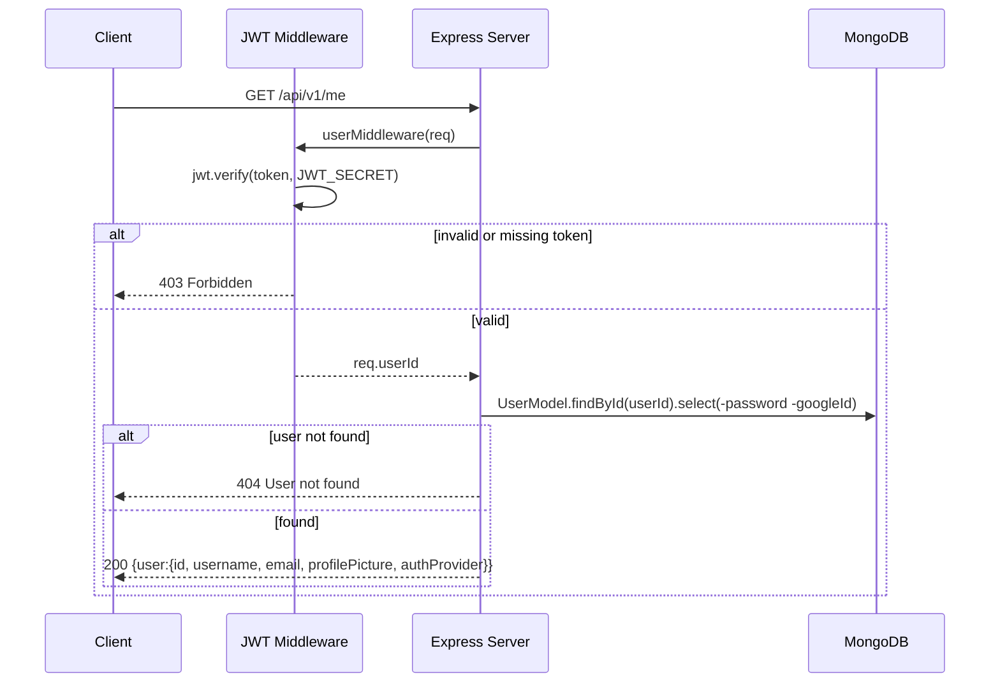

---

## 5. Frontend

### 5.1 Entry Point & Router

#### `src/main.tsx`
React root entry. Wraps the app in `<GoogleOAuthProvider clientId={config.GOOGLE_CLIENT_ID}>` from `@react-oauth/google`. Calls `ReactDOM.createRoot(...).render(...)`.

#### `src/App.tsx`
React Router v7 route tree:
```
/              → <Landing />
/signup        → <Signup />
/signin        → <Signin />
/dashboard     → <ProtectedRoute><Dashboard /></ProtectedRoute>
/share/:shareLink → <SharedBrain />
*              → <Navigate to="/" />
```
Also renders `<Toaster position="top-right" richColors />` (sonner) globally.

#### `src/config.ts`
```ts
export const config = {
  BACKEND_URL: import.meta.env.VITE_BACKEND_URL || 'http://localhost:5000',
  GOOGLE_CLIENT_ID: import.meta.env.VITE_GOOGLE_CLIENT_ID || '',
}
```

---

### 5.2 Pages

#### `pages/Landing.tsx` (~734 lines)
Full marketing landing page. Sections:
- **Navbar** — logo, nav links, CTA buttons, mobile hamburger menu with animated drawer
- **Hero** — headline with `TextShimmer`, subheading, two CTA buttons, mockup visual with `BorderBeam`
- **Platform carousel** — scrolling badges for YouTube, Twitter, GitHub, Medium, Instagram, any URL
- **Bento grid** — 8 feature cards using `MagicCard` hover effect, each with icon and description
- **How It Works** — 3-step numbered guide
- **Testimonials** — 3 cards with 5-star ratings, avatar, and quote
- **Value props callout** — highlighted feature summary
- **CTA section** — final sign-up push
- **Footer** — links and social icons

Uses: `GridPattern`, `TextShimmer`, `BlurFade`, `BorderBeam`, `MagicCard` from MagicUI.

#### `pages/Signup.tsx`
Registration form:
- Username and password fields
- Client-side validation (password 6+ chars)
- `GoogleSignInButton` for OAuth path
- On success: `toast.success` + redirect to `/signin`
- On error: displays API error message

#### `pages/Signin.tsx`
Login form:
- Username and password fields
- `GoogleSignInButton` for OAuth path
- On success: calls `setToken(jwt)` + redirect to `/dashboard`
- On error: displays API error message

#### `pages/dashboard.tsx`
Main application interface. Heavy component (~340 lines).

State managed:
| State | Purpose |
|-------|---------|
| `modalOpen` | Controls `CreateContentModal` visibility |
| `sidebarOpen` | Mobile sidebar drawer open/close |
| `filter` | Active type filter (`all`, `youtube`, etc.) |
| `searchQuery` | Text search string |
| `sortBy` | Active sort option |
| `deleteConfirm` | Delete confirmation dialog state + target contentId |
| `sharing` | Loading state for share toggle |
| `shareActive` | Whether brain is currently being shared |

Data hooks used: `useContents()`, `useUser()`, `useTags()`

**Keyboard shortcuts:**
- `Ctrl/Cmd+K` — open Add Content modal
- `Esc` — close modal or delete dialog
- `/` — focus search input (when not in a text field)

**Filtering & sorting pipeline** (pure client-side, no extra API calls):
1. Filter by `content.type === filter` (unless `filter === "all"`)
2. Filter by search query against `title`, `link`, and `tags[].name`
3. Sort by selected `SortOption`: `date-desc`, `date-asc`, `title-asc`, `title-desc`, `type`

**Share brain flow:**
- `shareActive = false` → POST `/api/v1/brain/share { share: true }` → copy URL to clipboard → set `shareActive = true`
- `shareActive = true` → POST `/api/v1/brain/share { share: false }` → set `shareActive = false`

**Content grid:** `1 col → sm:2 cols → lg:3 cols → xl:4 cols`

#### `pages/SharedBrain.tsx`
Public read-only view at `/share/:shareLink`:
- Fetches `GET /api/v1/brain/:shareLink`
- Displays username header + read-only content grid using `Card` components
- Shows error state if link is invalid or revoked

---

### 5.3 Components

#### `components/ProtectedRoute.tsx`
Auth guard. Checks `getToken()` and calls `useUser()`.  
- If no token → redirect to `/signin`
- If user fetch fails (401) → redirect to `/signin`  
- Shows loading spinner while verifying
- On success → renders `children`

#### `components/ui/Card.tsx`
Content card. Handles rendering for every content type:
- **YouTube**: `<iframe>` embed with `youtube.com/embed/{contentId}`
- **Twitter/X**: Twitter widget script + `<blockquote class="twitter-tweet">`, calls `window.twttr.widgets.load()`
- **Instagram**: oEmbed-style card
- **GitHub / Medium / Notion / link**: Link card with provider icon, title, and URL
- Action buttons: Copy link (clipboard), Delete (fires `onDelete` callback), Share

Provider icons: `YouTubeIcon`, `TwitterIcon`, `InstagramIcon`, `GitHubIcon`, `MediumIcon`, `NotionIcon`, `GlobeIcon`

#### `components/ui/Button.tsx`
Reusable button with variants:
- `variant`: `primary`, `secondary`, `danger`
- `size`: `sm`, `md`, `lg`
- Props: `text`, `onClick`, `loading` (shows spinner), `disabled`, `fullWidth`, `glow`, `startIcon`, `endIcon`

#### `components/ui/Input.tsx`
- `Input` — basic text input with placeholder and ref forwarding
- `PasswordInput` — same + toggle visibility button

#### `components/ui/GoogleSignInButton.tsx`
Wraps `@react-oauth/google`'s `useGoogleLogin` hook:
- On credential received: POST `/api/v1/auth/google` with `{ credential }`
- On success: calls `setToken(jwt)` + navigates to `/dashboard`

#### `components/ui/CreateContentModal.tsx`
Dialog form for saving new content:
- URL input with client-side validation via `quickValidateUrl()` from frontend provider system
- Title input
- Tag multi-select (select existing or create new)
- POST `/api/v1/content` on submit
- Calls `onContentAdded()` callback to trigger list refresh

#### `components/ui/Sidebar.tsx`
Left sidebar (fixed on desktop, drawer on mobile):
- Filter buttons: All, YouTube, Twitter, Instagram, GitHub, Medium, Notion, Link (generic)
- Tag list — each tag clickable; create new tag inline; delete tag with confirmation
- On mobile: triggered by hamburger button, slides in as overlay drawer

#### `components/ui/Dialog.tsx`
Low-level accessible dialog primitive built on **Radix UI `@radix-ui/react-dialog`**. Provides the building blocks used by `ConfirmDialog` and `CreateContentModal`.

Exported sub-components:
| Export | Role |
|--------|------|
| `Dialog` | Root state manager (controlled or uncontrolled) |
| `DialogTrigger` | Element that opens the dialog |
| `DialogPortal` | Renders children into a React portal (outside DOM tree) |
| `DialogOverlay` | Full-screen dark backdrop with fade animation |
| `DialogContent` | Centered modal panel with zoom+slide enter/exit animation |
| `DialogHeader` | Layout wrapper for title + description |
| `DialogFooter` | Layout wrapper for action buttons (stacks on mobile, row on desktop) |
| `DialogTitle` | Accessible heading (`role="dialog"` label) |
| `DialogDescription` | Accessible subtitle (muted text) |
| `DialogClose` | Element that closes the dialog |

All styled with `brand-*` Tailwind tokens and animated via Radix `data-[state]` attributes.

#### `components/ui/ConfirmDialog.tsx`
Generic confirmation modal built on top of `Dialog`:
- Props: `title`, `message`, `confirmText`, `cancelText`, `variant` (`danger` | `default`), `loading`
- Used for delete content confirmation

#### `components/ui/EmptyState.tsx`
Shown when user has no content. Displays instructional text and an "Add Content" button that opens the modal.

#### `components/ui/CardSkeleton.tsx`
Loading skeleton grid matching the `Card` component dimensions. `CardSkeletonGrid` renders `count` skeletons.

#### `components/ui/UserAvatar.tsx`
Shows user's profile picture (Google photo URL) or initials badge as fallback. Clicking opens a small dropdown with a Logout option.

#### `components/ui/TagBadge.tsx`
Pill-style tag chip. Optional `onDelete` prop renders an ×  button.

#### `components/ui/TagInput.tsx`
Multi-select tag input for the `CreateContentModal`. Supports selecting from existing tags and creating new ones inline.

#### `components/ui/SidebarItem.tsx`
Single filter/navigation button used inside `Sidebar`. Renders an icon + label as a full-width button.

Props: `text`, `icon` (ReactElement), `isActive` (boolean), `onClick`.  
Active state: highlighted with `brand-primary` text + `brand-surface` background. Used by `Sidebar` to render each content-type filter entry.

#### `components/ui/Spinner.tsx`
Simple CSS spinner for loading states.

---

### 5.4 Hooks

#### `hooks/useContents.tsx`
Fetches `GET /api/v1/content` on mount.

Returns:
```ts
{
  contents: Content[],
  loading: boolean,
  error: string | null,
  refetch: () => void
}
```

`Content` type: `{ _id, title, link, type, contentId, tags: { _id, name }[], userId, createdAt }`

#### `hooks/useUser.ts`
Fetches `GET /api/v1/me` on mount.

Returns:
```ts
{
  user: User | null,
  loading: boolean,
  logout: () => void,    // clears token + navigates to /signin
  refetch: () => void
}
```

#### `hooks/useTags.tsx`
Fetches `GET /api/v1/tags` on mount.

Returns:
```ts
{
  tags: Tag[],
  loading: boolean,
  error: string | null,
  createTag: (name: string) => Promise<Tag>,
  deleteTag: (tagId: string) => Promise<void>,
  refetch: () => void
}
```

`createTag` and `deleteTag` both call the respective API endpoints and then call `refetch()`.

---

### 5.5 Lib Utilities

#### `lib/api.ts`
Pre-configured Axios instance:
- `baseURL`: `config.BACKEND_URL`
- **Request interceptor**: reads token from `getToken()`, sets `Authorization: Bearer <token>` header on every request
- **Response interceptor**: on `401` response, calls `removeToken()` and redirects to `/signin`

#### `lib/auth.ts`
Simple token management via `localStorage`:
```ts
getToken()              // returns stored JWT or null
setToken(token: string) // saves to localStorage
removeToken()           // clears from localStorage
getAuthHeaders()        // returns { Authorization: 'Bearer <token>' }
```

#### `lib/utils.ts`
**`cn(...classes)`** — combines class strings with `clsx` + `tailwind-merge` to handle Tailwind class conflicts.

---

### 5.6 Providers (Frontend Mirror)

`frontend/src/providers/` contains exact mirrors of the backend provider implementations. Purpose: instant client-side URL validation and type detection in the `CreateContentModal` without a round-trip to the server.

Exports:
- `parseUrl(rawUrl)` — same as backend
- `quickValidateUrl(url)` — fast check used in the modal input
- `isValidUrl(url)` — http/https check
- `getEmbedUrl(type, contentId)` — generate embed URL client-side
- `getCanonicalUrl(type, contentId)` — canonical URL

Same 7 providers as backend: youtube, twitter, instagram, github, medium, notion, generic.

---

### 5.7 Icons

All in `src/icons/`, each is a React SVG component accepting `size` (`sm`/`md`/`lg`) and `className` props. All icons are re-exported from `icons/index.ts` as a single barrel.

| Icon component | Usage |
|---------------|-------|
| `Logo` | Navbar and landing page header (academic/brain SVG) |
| `YouTubeIcon` | Card, Sidebar |
| `TwitterIcon` | Card, Sidebar |
| `InstagramIcon` | Card, Sidebar |
| `GithubIcon` | Card, Sidebar |
| `MediumIcon` | Card, Sidebar |
| `NotionIcon` | Card, Sidebar |
| `GlobeIcon` | Generic link card |
| `PlusIcon` | Add Content button |
| `ShareIcon` | Share Brain button |
| `SearchIcon` | Search bar |
| `TrashIcon` | Delete button |
| `TagIcon` | Tag section in sidebar |
| `CrossIcon` | Clear search, close modal |
| `FolderIcon` | EmptyState |
| `ShieldIcon` | Landing page feature |
| `ZapIcon` | Landing page feature |
| `StarIcon` | Landing testimonials |
| `UsersIcon` | Landing page feature |
| `CheckIcon` | Success states |
| `CopyIcon` | Copy link button |
| `ArrowRightIcon` | CTA buttons |

---

### 5.8 MagicUI Components

Located in `src/components/magicui/`. Animation and visual effect primitives used on the landing page.

| Component | Effect |
|-----------|--------|
| `BlurFade` | Staggered fade-in with blur on scroll into view |
| `BorderBeam` | Animated glowing border that rotates around an element |
| `DotPattern` | Repeating dot background pattern |
| `GridPattern` | Repeating grid/line background pattern |
| `MagicCard` | Card with mouse-tracked gradient hover glow |
| `Particles` | Floating particle animation |
| `ShimmerButton` | Button with animated shimmer overlay |
| `TextShimmer` | Text with animated color shimmer sweep |

All exported from `magicui/index.ts`.

---

### 5.9 Types & Config

#### `types/tag.ts`
```ts
interface Tag {
  _id: string
  name: string
  userId: string
  createdAt: string
}
```

#### `config/providers.ts`
Frontend provider config flags mirroring `backend/src/config.ts`, used to conditionally register providers in the frontend provider registry.

---

### 5.10 Frontend Tests

Located in `src/__tests__/`, run with Vitest in `jsdom` environment.

**`providers.test.ts`**
- Tests `parseUrl()` for YouTube, Twitter, generic URLs
- Tests `isValidUrl()` and `quickValidateUrl()`
- Validates that invalid URLs return null

**`api.test.ts`**
- Tests the Axios instance request interceptor adds `Authorization` header
- Tests response interceptor redirects to `/signin` on 401

---

## 6. Frontend Routes

| Path | Component | Auth | Description |
|------|-----------|------|-------------|
| `/` | `Landing` | Public | Marketing page |
| `/signup` | `Signup` | Public | Create account |
| `/signin` | `Signin` | Public | Log in |
| `/dashboard` | `Dashboard` | Protected | Main app |
| `/share/:shareLink` | `SharedBrain` | Public | Read-only shared brain |
| `*` | — | — | Redirects to `/` |

---

## 7. Data Models

### Relationships

```
User (1) ──── (many) Content
User (1) ──── (many) Tag
User (1) ──── (0..1) Link
Content (many) ──── (many) Tag
```

### Enrichment State Machine

```
                    ┌─── (no configured extractor) ───► skipped
                    │
pending ────────────┤
                    │
                    └──► processing ──► enriched
                              │
                              ▼ (on error)
                         retry < maxRetries (3)?
                              │
                    ┌─── yes ─┴─ no ───┐
                    ▼                  ▼
               pending             failed
             (retry++)
```

`skipped` is reached from `pending` when `isExtractorConfigured(type)` returns false — before any atomic claim or API call. `failed` is reached from `processing` after exhausting all retries.

---

## 8. Environment Variables

### Backend (`backend/.env`)

| Variable | Required | Default | Description |
|----------|----------|---------|-------------|
| `MONGO_URI` | Yes | — | MongoDB Atlas connection string |
| `JWT_SECRET` | Yes | — | Secret key for signing JWTs (use `openssl rand -base64 32`) |
| `GOOGLE_CLIENT_ID` | Yes* | — | Google OAuth client ID (*required for Google sign-in) |
| `PORT` | No | `5000` | HTTP server port |
| `CORS_ORIGIN` | No | `http://localhost:5173` | Allowed CORS origin |
| `LOG_LEVEL` | No | `info` | Pino log level: `trace`, `debug`, `info`, `warn`, `error` |
| `YOUTUBE_API_KEY` | No | — | YouTube Data API v3 key (extractor falls back to Innertube if absent) |
| `GITHUB_TOKEN` | No | — | GitHub PAT (unauthenticated: 60 req/hr vs 5000 with token) |
| `TWITTER_BEARER_TOKEN` | No | — | Twitter API bearer token |
| `INSTAGRAM_APP_ID` | No | — | Instagram app ID |

### Frontend (`frontend/.env`)

| Variable | Required | Default | Description |
|----------|----------|---------|-------------|
| `VITE_BACKEND_URL` | No | `http://localhost:5000` | Backend API base URL |
| `VITE_GOOGLE_CLIENT_ID` | Yes* | — | Google OAuth client ID (must match backend) |

---

## 9. CI/CD

### `.github/workflows/ci.yml`

Triggered on: push or pull request to `main`.

**Backend job:**
1. Checkout
2. Node 20 setup with npm cache for `backend/`
3. `cd backend && npm ci`
4. `npx tsc --noEmit` — TypeScript type check
5. `npm test` — runs all Vitest integration tests

**Frontend job:**
1. Checkout
2. Node 20 setup with npm cache for `frontend/`
3. `cd frontend && npm ci`
4. `npm run lint` — ESLint
5. `npx tsc --noEmit` — TypeScript type check
6. `npm test` — runs all Vitest unit tests

Both jobs run in parallel, independently.

---

## 10. Key Flows End-to-End

### Saving a YouTube Video

1. User pastes `https://www.youtube.com/watch?v=abc123` into `CreateContentModal`
2. Frontend `quickValidateUrl()` detects `youtube` type instantly, shows green checkmark
3. User fills in title, clicks Save
4. `POST /api/v1/content { title, link, tags }` — backend `parseUrl()` extracts `contentId: "abc123"`, creates `Content` with `enrichmentStatus: 'pending'`
5. Within 30s, enrichment service picks it up:
   - Calls YouTube Data API v3 for title, description, channel, stats
   - Calls Innertube API for transcript
   - Saves `metadata` to Content document, sets `enrichmentStatus: 'enriched'`
6. Next time user loads dashboard, `GET /api/v1/content` returns the enriched content
7. `Card` component renders an `<iframe>` embed with the YouTube player

### Sharing a Brain

1. User clicks "Share Brain" on dashboard
2. `POST /api/v1/brain/share { share: true }` — backend creates `Link { hash: "a8Xk2mNp0q", userId }`
3. Frontend constructs `https://<origin>/share/a8Xk2mNp0q`, copies to clipboard
4. Share button turns red and shows "Stop Sharing"
5. Anyone visiting `/share/a8Xk2mNp0q` hits `GET /api/v1/brain/a8Xk2mNp0q`
6. `SharedBrain` page renders all content in read-only mode

### Google OAuth Sign-In

1. User clicks "Continue with Google" on `/signin`
2. `GoogleSignInButton` triggers Google OAuth popup via `@react-oauth/google`
3. Google returns a credential token (JWT from Google)
4. `POST /api/v1/auth/google { credential }` — backend verifies token with `OAuth2Client`
5. If first time: creates User doc; if existing email: links Google ID
6. Backend returns its own JWT (7-day expiry)
7. Frontend calls `setToken(jwt)`, navigates to `/dashboard`
